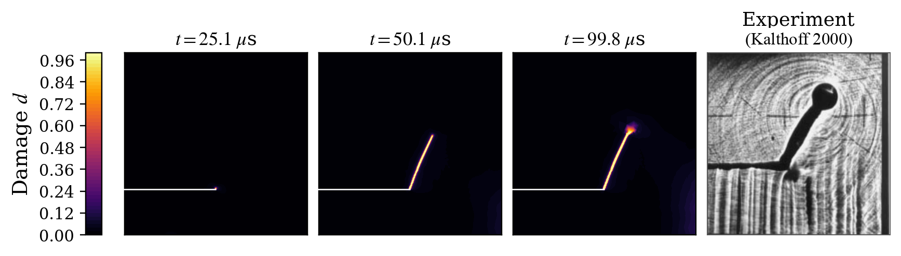
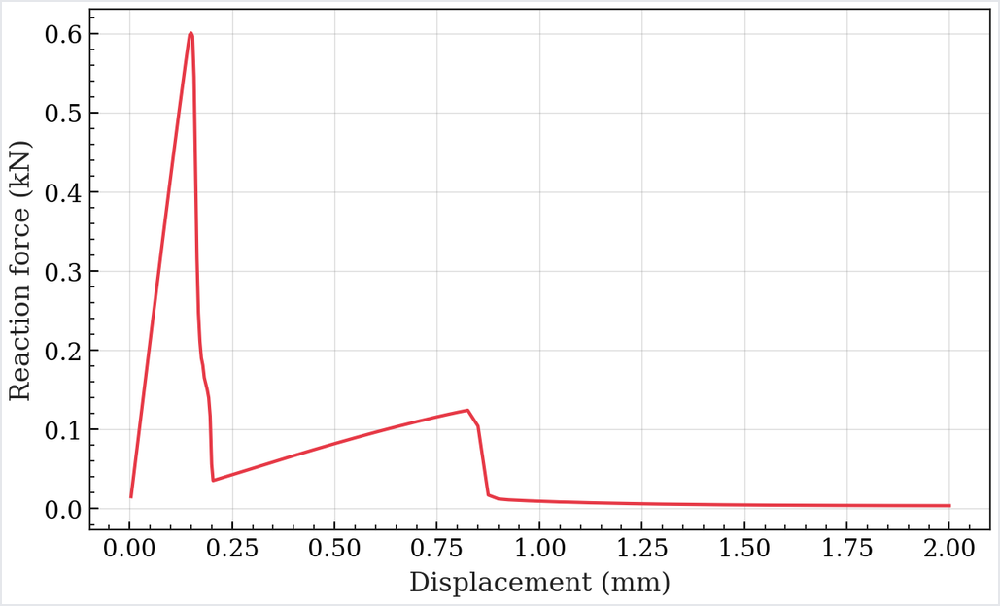
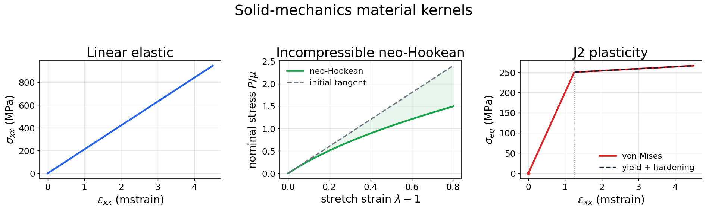

# Example gallery

This section maps core solver capabilities to runnable workflows in the
repository, so users can quickly check the project’s practical envelope.

## Representative results

The panels below are lightweight documentation thumbnails, not raw benchmark
archives. They point to the same workflows listed in the sections that follow.

## Start With These

| Example | Status | Modality | Command | Expected outputs | Inspect with | Enforced by |
|---|---|---|---|---|---|---|
| Miehe tension | Production | YAML-first | `python -m phast run examples/quasistatic/miehe_tension/config.yaml --output_dir runs/miehe_tension` | CSV histories, run metadata/lockfile, and checked-in gallery visuals/comparison artifacts; run explicit postprocessing if you need regenerated animations from a fresh solve | `phast.load_result("runs/miehe_tension")` | `examples/PUBLIC_EXAMPLES_CONTRACT.yaml`, `tests/test_public_examples_contract.py` |
| Notched-holed plate | Production | YAML-first | `python -m phast run examples/quasistatic/notched_holed_plate/config.yaml --output_dir runs/notched_holed_plate` | final damage, response CSVs, comparison report, visual manifest | `phast.load_result("runs/notched_holed_plate")` | `examples/PUBLIC_EXAMPLES_CONTRACT.yaml`, `tests/test_public_examples_contract.py` |
| Linear plate | Production | YAML-first | `python -m phast run examples/solid_mechanics/linear_plate/config.yaml --output_dir runs/linear_plate` | response curve, displacement, von Mises, strain energy, manifests | `phast.load_result("runs/linear_plate")` | `tests/test_solid_mechanics_yaml_runner.py` |
| Kalthoff-Winkler | Public candidate | YAML-first | `python -m phast run examples/dynamic/B2_kalthoff_winkler/config.yaml --output_dir runs/B2_kalthoff_winkler` | setup preview, damage image, energy/history CSVs, manifests | `phast.load_result("runs/B2_kalthoff_winkler")` | `examples/PUBLIC_EXAMPLES_CONTRACT.yaml`, `tests/test_public_examples_contract.py` |

Use the [capability matrix](user_guide/capability_matrix.md) before assuming a
workflow status. Use the
[promoted example contract](user_guide/example_contract.md) when adding or
auditing a gallery entry.

<figure>
  
  <figcaption>Dynamic fracture showcase: Kalthoff-Winkler impact crack growth.</figcaption>
</figure>

  

    
    <h3>Quasi-static fracture</h3>
    
Implicit AT1/AT2 crack-path workflows with comparison reports and
    standard run metadata.

  

  

    
    <h3>Dynamic fracture</h3>
    
Explicit dynamics for impact crack-growth benchmarks.

  

  

    
    <h3>Kalthoff-Winkler impact</h3>
    
Explicit dynamic fracture with crack-growth snapshots through the
    full public comparison window.

  

  

    
    <h3>Microstructured media</h3>
    
Perforated-plate and heterogeneous fracture cases used for dataset and
    morphology studies.

  

  

    
    <h3>Engineering outputs</h3>
    
Force-displacement, energy, convergence, lockfile, and visualization
    artifacts from reproducible runs.

  

  

    
    <h3>Solid mechanics</h3>
    
Linear elastic, hyperelastic, and J2 mechanics examples backed by the
    same sparse-solve and material-update paths used by the solver.

  

## Capability-first pathways

### Quasi-static fracture

The quasi-static family is the production path for many literature comparisons.

- **SENT / SENS / TPB / L-panel**: shipped benchmark configs under
  `configs/benchmarks/quasistatic/` and compare scripts in matching example
  directories.
- **Run example**:  
  `python -m phast run configs/benchmarks/quasistatic/QS_notched_holed_plate.yaml --validate-only`
- **Expected outputs**: `config.yaml`, `run_lockfile.json`, `results.csv`, plots.
  Run `compare.py` in `examples/quasistatic/notched_holed_plate/` for
  benchmark-level pass/fail summary.

### Explicit dynamics fracture

- **Branching, impact, perforation, Kalthoff-Winkler**:
  `configs/benchmarks/dynamic/*.yaml` plus matching run folders under
  `examples/dynamic/*`.
- **B7 dynamic branching**:
  `examples/dynamic/B7_dynamic_crack_branching_comsol/config.yaml` is the
  public-candidate full-plate COMSOL cross-check. Older half-plate B7
  diagnostic configs remain private provenance and are not gallery material.
- **Benchmark workflow**:
  1. Launch via `python -m phast run <cfg>`
  2. Run `compare.py` in the corresponding `examples/dynamic/<case>/` directory.
  3. Save comparison artifacts (`compare.txt`, `compare.png`) in run folder.

### Solid mechanics FEA and solver diagnostics

- `python -m phast run examples/solid_mechanics/linear_plate/config.yaml`
  Linear elastic plate FEA with displacement, stress, deformed-shape, response,
  and visual-manifest outputs.
- `python -m phast run examples/solid_mechanics/neohookean_plate/config.yaml`
  Nonlinear neo-Hookean cantilever FEA with Newton convergence and final-state
  field outputs.
- `python -m phast run examples/solid_mechanics/j2_bar/config.yaml`
  Mesh-level J2 plasticity bar FEA with von Mises and equivalent-plastic-strain
  fields.
- `examples/solid_mechanics/mixed_precision_cg/run.py`  
  Mixed-precision CG stability and residual behavior.
- `examples/solid_mechanics/generalized_alpha_oscillator/run.py`  
  Generalized-alpha exploration for implicit-dynamics prototyping.

### Beta plasticity, cohesive, and PF-CZM validation

- **J2 plasticity and ductile PF-plasticity**:
  `examples/plasticity_interface/run_j2_validation.py` and
  `examples/plasticity_interface/run_ductile_pf_plasticity_validation.py`.
- **Cohesive/interface benchmarks**:
  mode-I jump, mixed-mode, contact-compression, delamination patch, structural
  DCB, diffuse-interface, and coupled PF-cohesive smoke workflows live under
  `examples/plasticity_interface/`.
- **Manifested reproduction set**:
  `configs/benchmarks/plasticity_interface/manifests/customer_validation_examples.yaml`.
- **Generated visual outputs**:
  the scripts write `*.png`, manifest metadata, and summaries into their chosen
  output directories. These are beta validation artifacts until the nonlinear
  production gates in the capability matrix are closed.

## Tutorial map (ordered by onboarding value)

- [Getting started](getting-started.md)
- [Tutorial 1: Phase-field primer](tutorial/01_phase_field_primer.md)
- [Tutorial 3: Problem setup](tutorial/03_setting_up_your_problem.md)
- [Tutorial 4: Exploration experiments](tutorial/04_exploration_experiments.md)

## Showcase assets

A compact media index is curated under
[`assets/README.md`](https://github.com/CEMS-Lab/PhAST/blob/main/assets/README.md).
These images are documentation-ready and can be reused for capability pages,
proposals, and release notes.

## Capability boundaries

For current non-hardened features, review
[Capability matrix](user_guide/capability_matrix.md).  
This doc is also the source of truth for what can be promised publicly.
