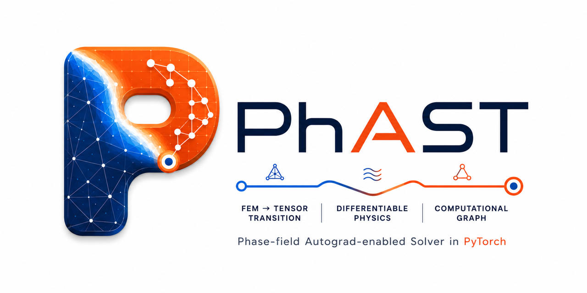

# PhAST

**Phase-field Autograd Solver in Torch**



<div class="phast-hero-panel">
  <div>
    <p class="phast-eyebrow">CEMS Lab · PyTorch-native FEM workflows</p>
    <h2>Differentiable phase-field fracture and FEM workflows in PyTorch.</h2>
    <p>
      PhAST is a state-of-the-art differentiable finite-element framework for
      2D brittle phase-field fracture, explicit dynamics, quasi-static
      benchmark reproduction, and promoted solid-mechanics examples. The public docs separate production,
      beta, optional-backend, scaffold, and unsupported capabilities so solver
      claims stay reproducible.
    </p>
    <p>
      Use the fluent <code>phast.Problem</code> API to author new models. Use
      YAML configurations for public examples, reproducibility, batch/HPC runs, and
      sharing exact simulations.
    </p>
    <p class="phast-hero-links">
      <a class="phast-button" href="getting-started.html">Get started</a>
      <a class="phast-button phast-button-secondary" href="example-gallery.html">View examples</a>
      <a class="phast-button phast-button-secondary" href="user_guide/capability_matrix.html">Capability matrix</a>
    </p>
  </div>
  <div class="phast-command-card">
    <p class="phast-command-title">Run a first check</p>
    <pre><code>pip install -e .
python -m phast doctor
python -m phast run examples/dynamic/B7_dynamic_crack_branching_comsol/config.yaml --validate-only
python -m phast run examples/quasistatic/miehe_tension/config.yaml --validate-only</code></pre>
  </div>
</div>

<figure class="phast-wide-figure">
  
  <figcaption>Dynamic fracture showcase: Kalthoff-Winkler impact crack growth.</figcaption>
</figure>

<div class="phast-card-grid">
  <div class="phast-card">
    <h3>Fluent authoring</h3>
    <p>Use the fluent <code>phast.Problem</code> API to author new models with
    domain nouns before saving or validating an declarative configuration.</p>
    <p><a href="user_guide/python_api.html">Python API</a></p>
  </div>
  <div class="phast-card">
    <h3>YAML input configurations</h3>
    <p>Use YAML configurations for public examples, reproducibility, sharing, CI, and
    batch/HPC runs with lockfiles, metadata, and standard outputs.</p>
    <p><a href="user_guide/yaml_workflow.html">YAML workflow</a></p>
  </div>
  <div class="phast-card">
    <h3>Visual examples</h3>
    <p>Browse damage fields, response curves, solid-mechanics outputs, and
    curated result panels linked to reproducible examples.</p>
    <p><a href="example-gallery.html">Example gallery</a></p>
  </div>
  <div class="phast-card">
    <h3>Clear claim boundaries</h3>
    <p>Brittle fracture and promoted solid mechanics are the public core.
    Plasticity, cohesive interfaces, and PF-CZM remain beta validation slices.</p>
    <p><a href="user_guide/capability_matrix.html">Capability matrix</a></p>
  </div>
</div>

## Which Path Should I Use?

| Goal | First page | Stable surface |
|---|---|
| Install and run a first case | [Getting started](getting-started.md) | `python -m phast doctor` |
| Author new models | [Python API](user_guide/python_api.md) and [Setting up problems](user_guide/setup_problems.md) | `phast.Problem` |
| Reproduce or batch-run examples | [YAML workflow](user_guide/yaml_workflow.md) | `python -m phast run config.yaml` |
| Inspect completed runs | [Results API](user_guide/results_api.md) | `phast.load_result(path)` |
| Browse runnable examples | [Example gallery](example-gallery.md) | flat public example folders |
| Check supported physics | [Capability matrix](user_guide/capability_matrix.md) | production / beta / scaffold labels |

```{toctree}
:maxdepth: 2
:caption: Get Started

installation
getting-started
user_guide/public_api_reference
showcase
tutorials
tutorial/01_phase_field_primer
tutorial/fluent_authoring_guide
tutorial/03_setting_up_your_problem
tutorial/04_exploration_experiments
user_guide/capability_matrix
```

```{toctree}
:maxdepth: 2
:caption: User Guide

user_guide/overview
user_guide/setup_problems
user_guide/python_api
user_guide/yaml_workflow
user_guide/problem_types
user_guide/physics
user_guide/configuration
user_guide/meshes
user_guide/example_contract
user_guide/results_api
user_guide/capability_matrix
user_guide/sparse_solve
user_guide/performance
```

```{toctree}
:maxdepth: 2
:caption: Supported Workflows

supported_workflows/solid_mechanics
supported_workflows/quasistatic_fracture
supported_workflows/dynamic_fracture
supported_workflows/plasticity_interface_beta
supported_workflows/unsupported_experimental
```

```{toctree}
:maxdepth: 2
:caption: Example Gallery

example-gallery
benchmarks/catalogue
```

```{toctree}
:maxdepth: 2
:caption: API Reference

user_guide/public_api_reference
api/public_workflow
api/sparse_solve
api/time_integrators
api/mixed_precision_cg
api/adaptive
```

```{toctree}
:maxdepth: 1
:caption: Output Standards

output_standards/index
user_guide/example_contract
user_guide/results_api
user_guide/data_and_devices
```

```{toctree}
:maxdepth: 1
:caption: Performance & Reproducibility

performance_reproducibility/index
```

```{toctree}
:maxdepth: 1
:caption: Community

community
```
