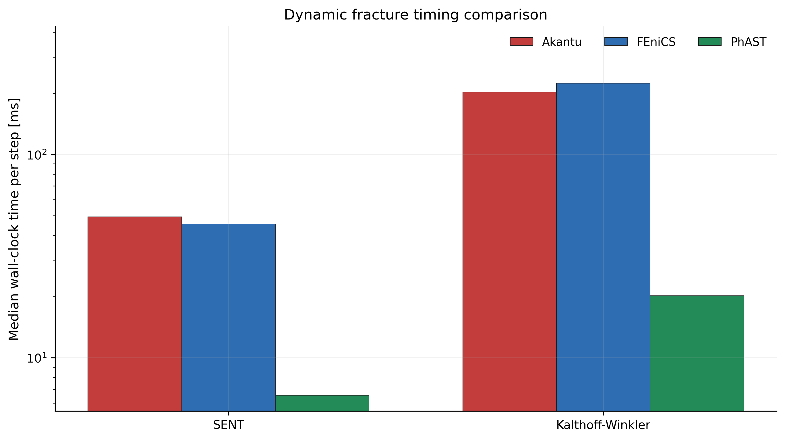

# Performance and Reproducibility

Use this page to choose a practical execution route before launching expensive
runs.

## Solver and device selection

| Situation | Recommended route |
|---|---|
| Validate a public YAML configuration | `python -m phast run <config.yaml> --validate-only` |
| Small or moderate float64 validation run | CPU first, especially when GPUs are queued |
| Large dynamic trajectory run | CUDA if available and queue wait is reasonable |
| Quasi-static fracture | `backend: auto`, Jacobi-safe defaults unless the configuration file pins another tested backend |
| Optional sparse-direct backends | Use PETSc/MUMPS, cuDSS, AmgX, or PyVista only where the capability matrix and local doctor output support them |

PhAST's reference public runs use double precision where the mechanics and
damage kernels require it. CUDA and CPU float64 are the most reliable choices
for publication runs. Apple MPS can be useful for exploratory float32 work, but
spectral/eigenvalue-sensitive fracture runs should be verified on CPU or CUDA
float64 before being used as evidence.

When submitting to HPC, prefer CPU nodes for runs that are memory-safe and
would otherwise wait behind GPU jobs. Use multiprocessing or array jobs only
when each case writes to a separate output directory and the manifest records
the exact command.

Always pass an explicit `--output_dir` for reproducible runs. Timestamped or
temporary output folders are convenient during local exploration, but paper
artifacts should live in stable directories with the corresponding config,
metadata, lockfile, CSV histories, and visuals kept together.

## Reproducibility checklist

1. Validate the YAML configuration.
2. Run with an explicit `--output_dir`.
3. Keep `run_manifest.json`, `run_metadata.json`, `run_lockfile.json`, CSVs,
   visuals, and `visual_manifest.json` together.
4. Store `training_data.zarr` trajectories outside git unless they are
   intentionally published as external release artifacts.
5. Inspect outputs with `phast.load_result(path)`.

See `docs/user_guide/example_contract.md` for the artifact contract.

## Benchmark policy

Performance comparisons are engineering snapshots, not fixed product claims.
Solver versions, optional backends, hardware, threading, tolerances, mesh
regeneration, and output settings can all change the result. Rerun the public
YAML configuration and record the generated manifests before using a timing
number in a paper, proposal, release note, or external comparison.

For fresh timing work, start from the same public entry points used by the
examples:

```bash
python -m phast run examples/dynamic/B2_kalthoff_winkler/config.yaml --device cuda --output_dir runs/B2_kalthoff_winkler
python -m phast run examples/dynamic/B3_dynamic_sent/config.yaml --device cuda --output_dir runs/B3_dynamic_sent
python -m phast run examples/quasistatic/miehe_tension/config.yaml --output_dir runs/miehe_tension
```

When publishing a timing comparison, report the exact command, device, PyTorch
version, mesh size, time step or load-step count, enabled output writers,
`run_lockfile.json`, and `run_metadata.json`. Avoid reusing older timing tables
unless the external solvers were rebuilt in release mode and the PhAST run was
regenerated with the current public configuration file.

## Dynamic timing comparison



This figure is regenerated from the current retained SENT and Kalthoff-Winkler
timing CSVs using Akantu, FEniCS, and PhAST final timing traces. Treat it as a
reproducibility artifact for Paper-1 performance discussion, not as a universal
hardware-independent claim. The source summary CSV is kept at
`assets/dynamic_timing_comparison.csv`.
