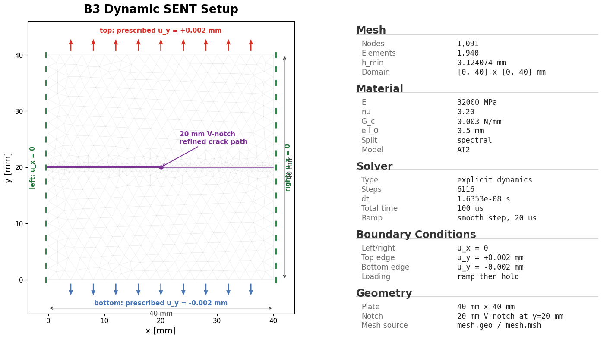
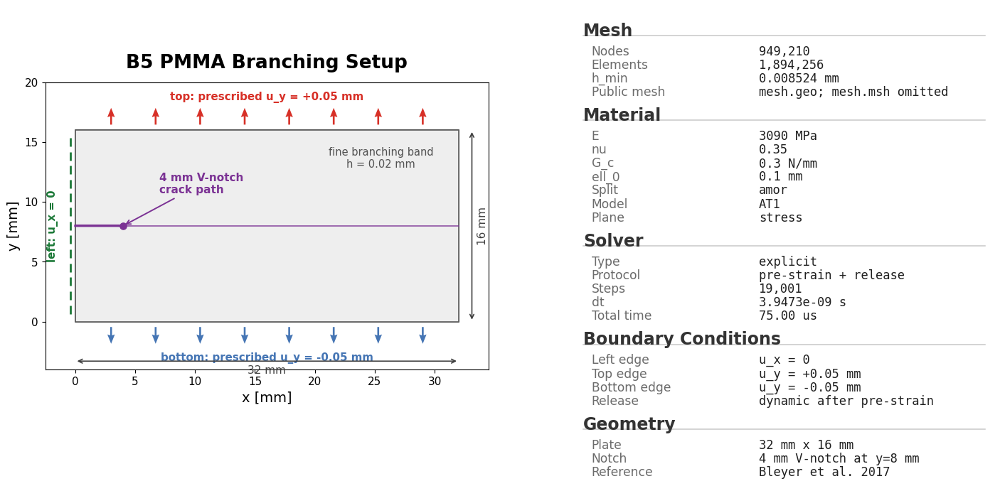
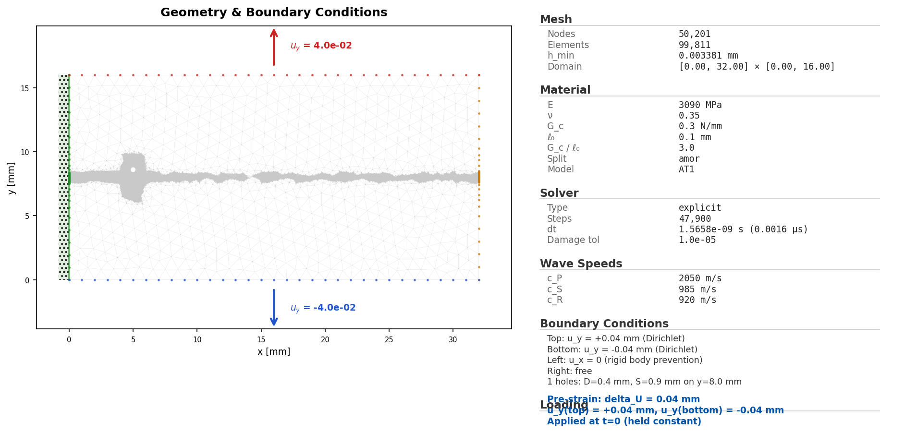
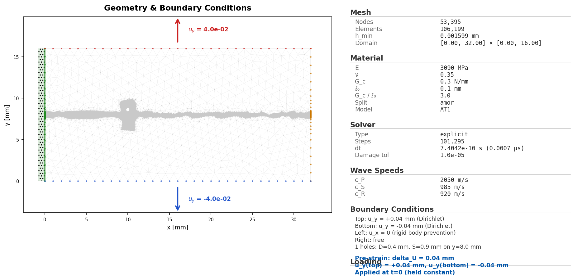
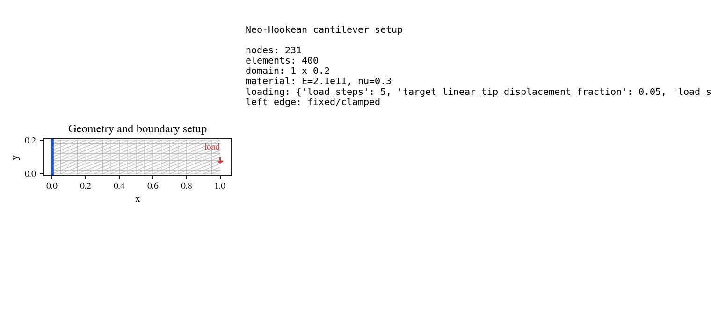

# Geometry and setup gallery

This gallery collects the public example geometries in one place. It is meant
for users who want to understand the mesh, notch, loading surface, and physical
regions before running a YAML configuration.

Each entry links to three files:

- `mesh.geo`: the Gmsh geometry source when the example stores one;
- `config.yaml`: the runnable PhAST input deck;
- `initial_conditions.png`: the setup preview used to inspect the geometry,
  boundary regions, and initial damage state.

Run any listed example from the repository root with:

```bash
python -m phast run <example>/config.yaml --validate-only
```

Use `--output_dir runs/<case>` for a full run.

## Quasi-static fracture

| Example | Setup preview | Geometry and input |
|---|---|---|
| Miehe tension |  | [`mesh.geo`](../../examples/quasistatic/miehe_tension/mesh.geo), [`config.yaml`](../../examples/quasistatic/miehe_tension/config.yaml) |
| Notched-holed plate |  | [`mesh.geo`](../../examples/quasistatic/notched_holed_plate/mesh.geo), [`config.yaml`](../../examples/quasistatic/notched_holed_plate/config.yaml) |

## Explicit dynamics

| Example | Setup preview | Geometry and input |
|---|---|---|
| Kalthoff-Winkler impact |  | [`mesh.geo`](../../examples/dynamic/B2_kalthoff_winkler/mesh.geo), [`config.yaml`](../../examples/dynamic/B2_kalthoff_winkler/config.yaml) |
| Dynamic SENT |  | [`mesh.geo`](../../examples/dynamic/B3_dynamic_sent/mesh.geo), [`config.yaml`](../../examples/dynamic/B3_dynamic_sent/config.yaml) |
| PMMA branching |  | [`mesh.geo`](../../examples/dynamic/B5_pmma_branching/mesh.geo), [`config.yaml`](../../examples/dynamic/B5_pmma_branching/config.yaml) |
| Perforated plate, 30 holes |  | [`mesh.geo`](../../examples/dynamic/B6_perforated_30holes/mesh.geo), [`config.yaml`](../../examples/dynamic/B6_perforated_30holes/config.yaml) |
| Perforated plate, 10 holes |  | [`mesh.geo`](../../examples/dynamic/B6_perforated_10holes/mesh.geo), [`config.yaml`](../../examples/dynamic/B6_perforated_10holes/config.yaml) |
| Perforated plate, one hole near crack |  | [`mesh.geo`](../../examples/dynamic/B6_perforated_1hole_near/mesh.geo), [`config.yaml`](../../examples/dynamic/B6_perforated_1hole_near/config.yaml) |
| Perforated plate, one hole far from crack |  | [`mesh.geo`](../../examples/dynamic/B6_perforated_1hole_far/mesh.geo), [`config.yaml`](../../examples/dynamic/B6_perforated_1hole_far/config.yaml) |
| Dynamic crack branching comparison |  | [`mesh.geo`](../../examples/dynamic/B7_dynamic_crack_branching_comsol/mesh.geo), [`config.yaml`](../../examples/dynamic/B7_dynamic_crack_branching_comsol/config.yaml) |

## Solid-mechanics examples

| Example | Setup preview | Geometry and input |
|---|---|---|
| Linear plate |  | [`mesh.geo`](../../examples/solid_mechanics_beta/linear_plate/mesh.geo), [`config.yaml`](../../examples/solid_mechanics_beta/linear_plate/config.yaml) |
| Neo-Hookean plate |  | [`mesh.geo`](../../examples/solid_mechanics_beta/neohookean_plate/mesh.geo), [`config.yaml`](../../examples/solid_mechanics_beta/neohookean_plate/config.yaml) |
| J2 bar |  | [`mesh.geo`](../../examples/solid_mechanics_beta/j2_bar/mesh.geo), [`config.yaml`](../../examples/solid_mechanics_beta/j2_bar/config.yaml) |

## Reading a setup preview

The setup preview is not a final result. It is a pre-solve check of the finite
element model:

- geometry dimensions and holes/notches;
- named regions used by boundary conditions and outputs;
- initial crack or damage preseed, when present;
- mesh refinement near the expected fracture path.

Before running an expensive simulation, inspect the preview and run
`--validate-only`. If the preview does not match the intended physical problem,
fix the geometry or region names before solving.

