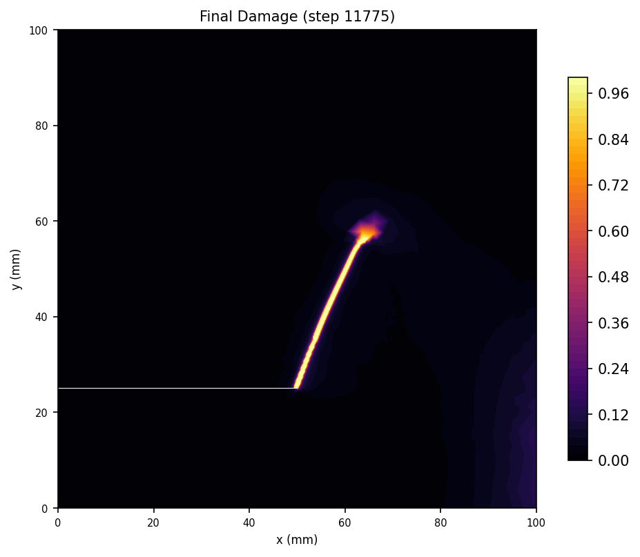
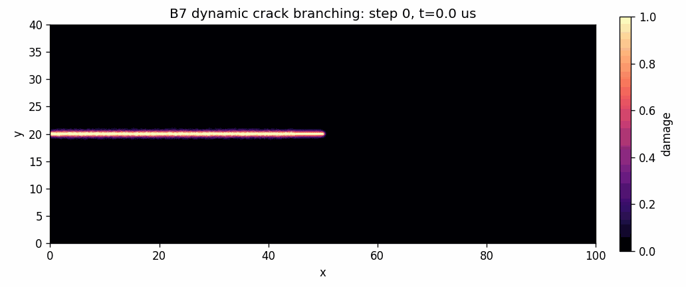

# Physics, Units, and Formulation

This page summarizes the continuum model used by PhAST and maps the main
symbols to the YAML and fluent Python interfaces. It is intended as the bridge
between the paper formulation, the public examples, and the executable solver
configuration.

For sparse-direct and autograd-enabled linear-solve details, see
[Sparse and Matrix-Free Solves](sparse_solve.md).

## Variational Fracture Model

Sharp Griffith fracture minimizes elastic energy plus crack-surface energy:

$$
\mathcal{E}(\mathbf{u}, \Gamma)
= \int_{\Omega} \psi(\boldsymbol{\varepsilon}(\mathbf{u})) \, d\Omega
  + G_c \, \mathcal{H}^{n-1}(\Gamma),
$$

where $\mathbf{u}$ is displacement, $\Gamma$ is the crack set, $G_c$ is the
critical energy release rate, and $\mathcal{H}^{n-1}$ measures crack surface.
Phase-field fracture replaces the sharp crack by a scalar damage field
$d \in [0, 1]$, where $d=0$ is intact and $d=1$ is fully damaged.
The damaged set can be interpreted as a regularized crack band whose width is
controlled by $\ell_0$; in practical meshes, the visible diffuse band is
typically spread over a few elements around the crack centreline.

PhAST uses the regularized energy

$$
\mathcal{E}(\mathbf{u}, d)
= \int_{\Omega} g(d) \, \psi^+(\boldsymbol{\varepsilon}(\mathbf{u})) \, d\Omega
  + \int_{\Omega} \psi^-(\boldsymbol{\varepsilon}(\mathbf{u})) \, d\Omega
  + G_c \int_{\Omega}
    \left[
      \frac{w(d)}{c_w \ell_0}
      + \frac{\ell_0}{c_w} \lvert \nabla d \rvert^2
    \right] d\Omega .
$$

The degradation function is

$$
g(d) = (1-d)^2 + \eta,
$$

with a small residual stiffness $\eta$ to avoid singular stiffness rows in
fully damaged zones. The length scale $\ell_0$ controls the width of the
diffuse crack band.

The equivalent crack surface density is often written separately as

$$
\gamma(d, \nabla d)
= \frac{w(d)}{c_w \ell_0}
  + \frac{\ell_0}{c_w} \lvert \nabla d \rvert^2 .
$$

## Governing Equations

For quasistatic brittle fracture, the displacement field satisfies mechanical
equilibrium with degraded tensile energy:

$$
\nabla \cdot \boldsymbol{\sigma} = \mathbf{0}
\quad \text{in } \Omega,
$$

with

$$
\boldsymbol{\sigma}
= g(d) \, \frac{\partial \psi^+}{\partial \boldsymbol{\varepsilon}}
  + \frac{\partial \psi^-}{\partial \boldsymbol{\varepsilon}} .
$$

The usual mechanical boundary conditions are

$$
\mathbf{u}=\bar{\mathbf{u}} \quad \text{on } \partial\Omega_D,
\qquad
\boldsymbol{\sigma}\mathbf{n}=\bar{\mathbf{t}}
\quad \text{on } \partial\Omega_N .
$$

For AT2 with history-field irreversibility, the damage equation has the common
linearized form

$$
-G_c \ell_0 \nabla^2 d
+ \left(\frac{G_c}{\ell_0} + 2\mathcal{H}\right)d
= 2\mathcal{H},
$$

where

$$
\mathcal{H}(\mathbf{x}, t)
= \max_{\tau \leq t} \psi^+
\left(\boldsymbol{\varepsilon}(\mathbf{u}(\mathbf{x}, \tau))\right).
$$

The natural phase-field boundary condition is

$$
\nabla d \cdot \mathbf{n} = 0
\quad \text{on } \partial\Omega .
$$

For explicit dynamics, PhAST solves the momentum balance

$$
\rho \, \ddot{\mathbf{u}} =
\nabla \cdot \boldsymbol{\sigma} + \mathbf{b},
$$

with damage updated through the configured phase-field substep cadence.

## AT1 and AT2 Dissipation

The regularization choice enters through $w(d)$ and $c_w$:

| Model | $w(d)$ | $c_w$ | Consequence |
|---|---:|---:|---|
| AT1 | $d$ | $8/3$ | Has an elastic threshold before damage nucleation. |
| AT2 | $d^2$ | $1/2$ | Smooth damage response; commonly used for pre-cracked propagation. |

```{figure} ../_static/at_dissipation.svg
:alt: AT1 and AT2 dissipation functions
:width: 78%

AT1 grows linearly with damage and gives a threshold-like response. AT2 is
quadratic and is smoother for propagation from an existing notch.
```

The AT1 threshold is often written as

$$
\mathcal{H}_{c,0} = \frac{3G_c}{16\ell_0}.
$$

In PhAST, choose the model with `material.overrides.pf_model: AT1` or
`material.overrides.pf_model: AT2`.

For AT1, the damage update is a bound-constrained variational problem. The
lower bound must be enforced during the iterative solve; a post-solve clamp is
not equivalent to the active-set solve.

## Energy Splits

Damage should not degrade compressive strain energy. PhAST therefore splits
the elastic energy into tensile and compressive parts:

$$
\psi(\boldsymbol{\varepsilon})
= \psi^+(\boldsymbol{\varepsilon})
  + \psi^-(\boldsymbol{\varepsilon}),
$$

and applies $g(d)$ only to $\psi^+$. The public configuration key is
`material.overrides.energy_split`.

| `energy_split` | Degraded energy | Typical use |
|---|---|---|
| `isotropic` | full elastic energy | Pure mode-I debugging or cases without compression. |
| `amor` | volumetric tension plus deviatoric energy | Robust default for mixed loading. |
| `spectral` | tensile principal-strain contribution | Miehe-style crack turning and branching. |
| `spectral_stress` | tensile principal-stress contribution | Opt-in parity studies. |
| `star_convex` | tensile full energy with compressive deviatoric treatment | Nucleation and convergence studies. |

The distinction is visible in bending, impact, and branching examples, where
compressive regions should not create artificial damage. The public dynamic
gallery includes crack curvature and branching examples such as
`examples/dynamic/B2_kalthoff_winkler/` and
`examples/dynamic/B7_dynamic_crack_branching_comsol/`.

<table>
  <tr>
    <td align="center" width="50%">
      
    </td>
    <td align="center" width="50%">
      
    </td>
  </tr>
  <tr>
    <td align="center"><strong>Mixed-mode impact</strong></td>
    <td align="center"><strong>Dynamic branching</strong></td>
  </tr>
</table>

## Plane Strain and Plane Stress

Two-dimensional examples use either plane strain or plane stress. The main
difference is the effective elastic operator. In plane strain,
$\varepsilon_{zz}=0$ and the Lamé parameter is

$$
\lambda_{\mathrm{PE}}
= \frac{E\nu}{(1+\nu)(1-2\nu)} .
$$

In plane stress, $\sigma_{zz}=0$ and the in-plane reduction uses

$$
\lambda_{\mathrm{PS}}
= \frac{E\nu}{1-\nu^2}.
$$

The public fracture examples choose the assumption through their material and
workflow settings. Miehe-style spectral split studies are usually documented as
plane strain, while thin PMMA dynamic examples are typically treated with
plane-stress settings and an Amor-style split.

## Staggered Solver Loop

The coupled fracture problem is solved by alternate minimization: freeze the
damage field, solve mechanics, then freeze mechanics and solve damage. The
iteration stops when the damage update is sufficiently small.

```{mermaid}
flowchart TD
    A[Start load or time step] --> B[Freeze damage d]
    B --> C[Solve mechanics for displacement u]
    C --> D[Update tensile history field H]
    D --> E[Freeze displacement u]
    E --> F[Solve damage equation for d]
    F --> G[Apply irreversibility and bounds]
    G --> H{norm_inf(d_new - d_old) < tolerance?}
    H -- no --> B
    H -- yes --> I[Store fields, histories, and visuals]
    I --> J[Advance to next step]
```

In notation, the convergence check is

$$
\lVert d^{k+1} - d^k \rVert_{\infty} < \varepsilon_{\mathrm{stag}},
$$

where $\varepsilon_{\mathrm{stag}}$ maps to the configured staggered tolerance.

## Matrix-Free Operator View

PhAST's public fracture path applies finite-element operators through
gather-compute-scatter tensor kernels rather than assembling a global stiffness
matrix for every operator application. For a linearized internal force
$\mathbf{f}_{\mathrm{int}}$, the Krylov product can be viewed as

$$
\mathbf{K}\mathbf{p}
= \mathbf{f}_{\mathrm{int}}(\mathbf{p})
  - \mathbf{f}_{\mathrm{int}}(\mathbf{0}),
$$

or, around a nonlinear reference state $\bar{\mathbf{u}}$,

$$
\mathbf{K}(\bar{\mathbf{u}})\mathbf{p}
\approx
\mathbf{f}_{\mathrm{int}}(\bar{\mathbf{u}}+\mathbf{p})
- \mathbf{f}_{\mathrm{int}}(\bar{\mathbf{u}}).
$$

This is the matrix-free sense used throughout the repository: the solver
materializes the action of the weak-form operator on a vector, while avoiding a
persistent global stiffness matrix unless an optional sparse-direct pathway or
preconditioner setup explicitly requires one.

## Symbol to Configuration Map

| Mathematical symbol | Meaning | YAML/API location |
|---|---|---|
| $\mathbf{u}$ | displacement field | output field `displacement`; boundary conditions on `u_x`, `u_y` |
| $d$ | phase-field damage | output field `damage` |
| $E$ | Young's modulus | `material.E` or material preset override |
| $\nu$ | Poisson ratio | `material.nu` or material preset override |
| $G_c$ | fracture toughness | `material.Gc` or material preset override |
| $\ell_0$ | regularization length | `material.l0` or material preset override |
| $\eta$ | residual stiffness | `material.eta_residual` |
| $w(d)$ | AT1/AT2 local dissipation | `material.overrides.pf_model` |
| $\psi^+$, $\psi^-$ | tensile/compressive energy split | `material.overrides.energy_split` |
| $\varepsilon_{\mathrm{stag}}$ | staggered convergence tolerance | solver damage/staggered tolerance key |

## Unit System

The public examples use a consistent mm-N-MPa-s convention unless a local README
states otherwise:

| Quantity | Unit |
|---|---|
| Length | mm |
| Force | N |
| Stress and Young's modulus | MPa = N/mm$^2$ |
| Fracture toughness $G_c$ | N/mm |
| Regularization length $\ell_0$ | mm |
| Density in dynamic examples | consistent with mm-N-MPa-s time scaling |

Mesh resolution should be judged relative to $\ell_0$. A common rule of thumb is

$$
h \leq \frac{\ell_0}{2}
$$

near the expected crack path, with local refinement around notches, holes, or
branching regions.

## References

- Bourdin, B., Francfort, G. A., and Marigo, J.-J. (2000). Numerical
  experiments in revisited brittle fracture. *Journal of the Mechanics and
  Physics of Solids*.
- Amor, H., Marigo, J.-J., and Maurini, C. (2009). Regularized formulation of
  the variational brittle fracture with unilateral contact. *International
  Journal for Numerical Methods in Engineering*.
- Miehe, C., Welschinger, F., and Hofacker, M. (2010). Thermodynamically
  consistent phase-field models of fracture. *International Journal for
  Numerical Methods in Engineering*.
- Kumar, A., Francfort, G. A., and Lopez-Pamies, O. (2020). Revisiting
  nucleation in the phase-field approach to brittle fracture. *Journal of the
  Mechanics and Physics of Solids*.
- PhaseFieldX documentation: https://phasefieldx.readthedocs.io/
