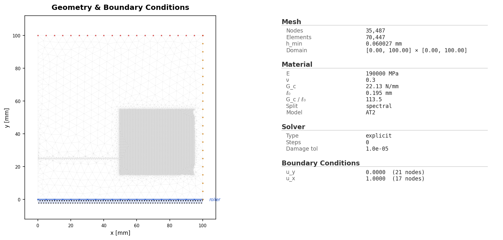
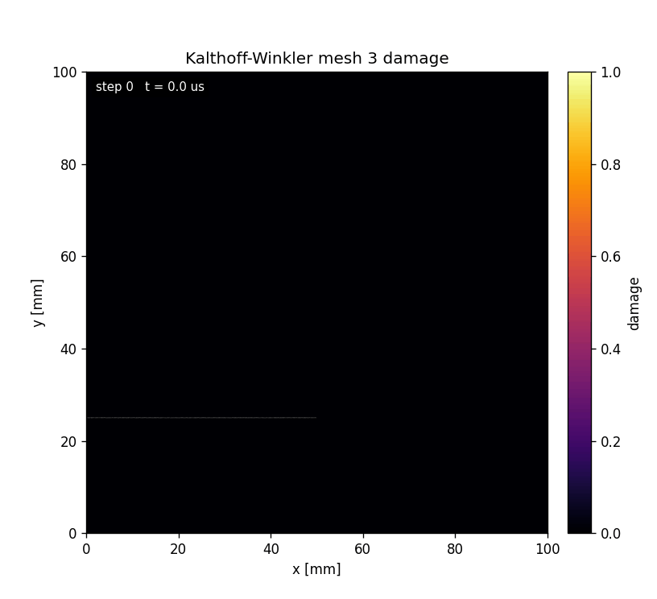

# B2 Kalthoff-Winkler

Dynamic Kalthoff-Winkler impact example based on Borden et al. (2012). The public folder contains the runnable YAML deck and lightweight mesh-3 evidence from the canonical half-plate reference environment run `kalthoff_halfplate_19148/mesh3_h0.25`.

All public-facing artifacts for this example stay directly in this folder. Full run folders, heavy trajectory stores, external COMSOL model files, and diagnostic diagnostics are intentionally excluded.

## What This Example Solves

- 100 mm x 100 mm half-plate Kalthoff-Winkler impact geometry with bottom symmetry.
- Material model: maraging steel, AT2 phase field, spectral split, plane strain, explicit dynamics.
- Loading: x-direction velocity impact on the left impact set, ramped to 16.5 m/s.
- Reference evidence: mesh-3 initial conditions, final damage, field damage animation, energy response animation, history, energy, crack-tip, timing, and run metadata.

The YAML deck is the canonical public input for this example. The reference evidence was produced in the reference environment with a single A100 80 GB GPU; the mesh-3 run metadata records 35,487 nodes, 70,447 elements, 11,775 explicit steps, and 79.22 s wall time. Do not regenerate this full benchmark during lightweight contract checks.

## Files

| File | Purpose |
| --- | --- |
| `README.md` | This contract-shaped public example guide. |
| `config.yaml` | Canonical public YAML input deck for `python -m phast run`. |
| `crack_tip.csv` | Mesh-3 crack-tip tracking output. |
| `damage_evolution.gif` | GitHub-renderable mesh-3 damage evolution animation generated from the retained H5 trajectory in the reference environment. |
| `damage_evolution.mp4` | MP4 version of the mesh-3 damage evolution animation. |
| `damage_final.png` | Mesh-3 final damage field. |
| `energy.csv` | Mesh-3 dynamic energy history output. |
| `history.csv` | Mesh-3 lightweight damage/history output. |
| `initial_conditions.png` | Mesh-3 initial-condition visual. |
| `mesh.geo` | Gmsh geometry/provenance file for the half-plate h=0.25 mm mesh. |
| `mesh.msh` | Exact reference mesh exported from the reference environment H5 trajectory; matches `run_metadata.json` node and element counts. |
| `response_evolution.mp4` | Energy-response animation generated from `energy.csv`. |
| `run_fluent.py` | Optional Python/manual setup companion mirroring the public YAML deck. |
| `run_lockfile.json` | Reproducibility lockfile with resolved public config and reference run metadata. |
| `run_manifest.json` | Public manifest describing curated source, reference source, files, and omitted large artifacts. |
| `run_metadata.json` | Recorded mesh-3 run metadata for the reference output bundle. |
| `thumbnail.png` | Compact preview image, currently the final damage field. |
| `timing_per_step.csv` | Mesh-3 per-step timing output. |
| `visual_manifest.json` | Manifest for reference visual artifacts, dimensions, sizes, and media checks. |

## Run The Canonical YAML Deck

From the repository root:

```bash
python -m pip install -e .
python -m phast doctor
python -m phast run examples/dynamic/B2_kalthoff_winkler/config.yaml --validate-only
```

Run the full YAML deck only when you intend to regenerate the dynamic result bundle:

```bash
python -m phast run examples/dynamic/B2_kalthoff_winkler/config.yaml \
  --output_dir examples/dynamic/B2_kalthoff_winkler/run_local
```

For a short local configuration check, keep the validation path above or use the runner's available CLI overrides in a temporary output directory:

```bash
python -m phast run examples/dynamic/B2_kalthoff_winkler/config.yaml \
  --num_steps 5 \
  --output_dir examples/dynamic/B2_kalthoff_winkler/run_quick
```

Do not treat the short check as benchmark evidence; it is only a quick check for the input deck and runner plumbing.

To regenerate a fresh Gmsh mesh from the public geometry recipe:

```bash
gmsh examples/dynamic/B2_kalthoff_winkler/mesh.geo \
  -2 -format msh2 \
  -o examples/dynamic/B2_kalthoff_winkler/mesh.msh
```

The checked-in `mesh.msh` is the authoritative executed mesh exported from the reference trajectory data. It matches `run_metadata.json` exactly: 35,487 nodes and 70,447 triangles. Regenerating from `mesh.geo` is useful for reruns, but Gmsh version and import/export choices can produce small node/element-count differences.

## How The YAML Is Used

`python -m phast run ...` reads `config.yaml`, validates the schema, applies any CLI overrides, resolves the deck into runtime objects, writes the resolved config into the output directory, and then starts the explicit dynamic solver. The main YAML blocks map to runtime setup as follows:

| YAML block | Runtime meaning |
| --- | --- |
| `problem` | Human-readable problem name and reference text saved into logs and metadata. |
| `geometry` | Half-plate Kalthoff generator settings, mesh-size controls, and the public `mesh.geo`/`mesh.msh` provenance files. |
| `material` | Elastic, fracture, density, phase-field, split, residual-stiffness, and plane-stress settings. |
| `boundary_conditions` | Named mesh groups mapped to impact and symmetry constraints. |
| `loading` | Dynamic impact protocol, total simulation time, ramp time, and impact velocity. |
| `solver` | Explicit dynamics settings such as `solver_type`, `dt_safety`, and damage cadence. |
| `output` | Requested trajectory, CSV, animation, print-cadence, and fast-output settings. |

Use YAML for reproduction, review, and batch/accelerated compute execution because the deck is the artifact copied with run outputs and mirrored in the lockfile.

## Run Without YAML

Use `run_fluent.py` when you want to assemble the same explicit-dynamics model directly through Python instead of loading the YAML deck:

```bash
python examples/dynamic/B2_kalthoff_winkler/run_fluent.py \
  --output-dir examples/dynamic/B2_kalthoff_winkler/run_fluent
```

For a short local check, pass an explicit step count:

```bash
python examples/dynamic/B2_kalthoff_winkler/run_fluent.py \
  --num-steps 5 \
  --output-dir examples/dynamic/B2_kalthoff_winkler/run_fluent_quick
```

The YAML deck remains the canonical public reproduction input because it is the artifact used by release manifests and lockfiles.

## How Manual Setup Works

Manual setup means creating the same objects that the YAML runner creates for you:

| Manual step | Equivalent YAML block |
| --- | --- |
| Choose benchmark name and reference | `problem` |
| Define the half-plate geometry, notch, impact region, symmetry edge, and mesh controls | `geometry` |
| Set `E`, `nu`, `Gc`, `l0`, density, split, model, residual stiffness, and plane-stress mode | `material` |
| Apply left-impact velocity and bottom symmetry constraints | `boundary_conditions` |
| Define velocity-impact protocol, ramp time, and total simulation time | `loading` |
| Choose explicit dynamics settings and damage cadence | `solver` |
| Request CSV histories, trajectories, plots, manifests, and animations | `output` |
| Execute through the public runner | CLI run command |

The Python runner builds the same mesh, material, boundary-condition, solver, and output objects as the YAML workflow.

## Reference Result

| Initial conditions | Damage evolution |
|---|---|
|  |  |

| Quantity | Reference evidence | Status |
| --- | --- | --- |
| Recorded run | reference A100 mesh-3 evidence; 35,487 nodes, 70,447 elements, 11,775 explicit steps | PRESENT |
| Public field animation | `damage_evolution.gif` and `damage_evolution.mp4` generated from mesh-3 `external trajectory store` in the reference environment | PRESENT |
| Public response animation | `response_evolution.mp4` generated from mesh-3 `energy.csv` | PRESENT |
| Excluded large files | `external trajectory store`, full run logs, and temporary result directories stay out of the public bundle | ENFORCED |

To regenerate the reference visuals without transferring the H5 file, post-process in the reference environment in:

```bash
~/shared-results/torch_pf_solver_bench/results/kalthoff_halfplate_19148/mesh3_h0.25
```

Then rsync only the lightweight CSV, PNG, GIF, MP4, JSON, and YAML artifacts back into this flat public folder.
