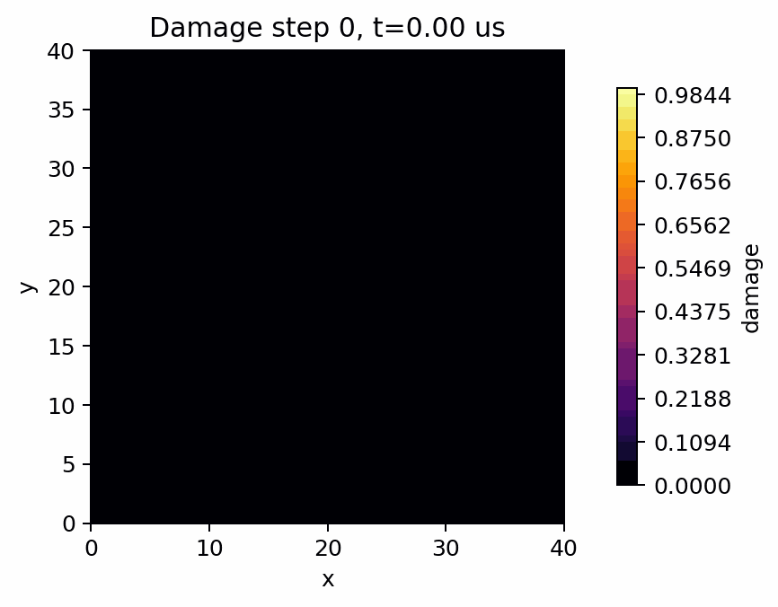

# B3 Dynamic SENT

Dynamic single-edge-notched tension lightweight example based on Borden et al. (2012). The folder provides a compact explicit-dynamics demonstration and keeps the curated SENT CSV, PNG, and animation outputs beside the YAML configuration.

All public-facing artifacts for this example stay directly in this folder. Full run folders, heavy trajectory stores, external COMSOL model files, and diagnostic outputs are intentionally excluded.

## 1. Problem Description

- 40 mm x 40 mm SENT plate with a 20 mm wedge notch generated through the geometry DSL and mirrored by `mesh.geo`.
- Material model: soda-lime glass, AT2 phase field, spectral split, explicit dynamics.
- Loading: smooth-step prescribed vertical displacement on the top and bottom edges, ramped to `u_y = +/-0.002 mm` over 20 us and then held; left and right edges are constrained in `x`.
- Claim boundary: qualitative lightweight dynamic fracture evidence, not convergence-quality benchmark validation.

The YAML configuration is the canonical public input for this example. Expected runtime depends strongly on mesh size, device, and output cadence; the checked-in outputs are curated evidence and should not be regenerated during lightweight contract checks.


## Run The Canonical YAML Configuration

From the repository root:

```bash
python -m pip install -e .
python -m phast doctor
python -m phast run examples/dynamic/B3_dynamic_sent/config.yaml --validate-only
```

Run the full YAML configuration only when you intend to regenerate the dynamic result bundle:

```bash
python -m phast run examples/dynamic/B3_dynamic_sent/config.yaml \
  --output_dir examples/dynamic/B3_dynamic_sent/run_local
```

For a short local configuration check, keep the validation path above or use the runner's available CLI overrides in a temporary output directory:

```bash
python -m phast run examples/dynamic/B3_dynamic_sent/config.yaml \
  --num_steps 5 \
  --output_dir examples/dynamic/B3_dynamic_sent/run_quick
```

Do not treat the short check as benchmark evidence; it is only a quick check for the declarative configuration and runner plumbing.

To regenerate a fresh Gmsh mesh from the public geometry recipe:

```bash
gmsh examples/dynamic/B3_dynamic_sent/mesh.geo \
  -2 -format msh2 \
  -o examples/dynamic/B3_dynamic_sent/mesh.msh
```

The checked-in `mesh.msh` is the mesh used by the curated public evidence. Regenerating from `mesh.geo` is useful for reruns, but Gmsh version and import/export choices can produce small node/element-count differences.

## How The YAML Is Used

`python -m phast run ...` reads `config.yaml`, validates the schema, applies any CLI overrides, resolves the configuration file into runtime objects, writes the resolved config into the output directory, and then starts the explicit dynamic solver. The main YAML blocks map to runtime setup as follows:

| YAML block | Runtime meaning |
| --- | --- |
| `problem` | Human-readable problem name and reference text saved into logs and metadata. |
| `acceptance` | Claim-boundary or validation metadata when present; it does not define the PDE solve. |
| `geometry` | Mesh generator, geometry DSL, named regions, notch/hole definitions, and mesh-size controls. |
| `material` | Elastic, fracture, density, phase-field, split, and plane-stress settings used to build material objects. |
| `boundary_conditions` | Named mesh groups mapped to fixed, prescribed, traction, symmetry, or phase-field constraints. |
| `initial_conditions` | Optional pre-crack or damage preseeding, when the benchmark requires it. |
| `loading` | Time horizon, dynamic load protocol, impact/prestrain/traction ramp, and step controls. |
| `solver` | Explicit dynamics settings such as `solver_type`, `dt_safety`, damage cadence, and solver options. |
| `output` | Requested trajectories, CSV histories, plots, animations, print cadence, and fast-output settings. |

Use YAML for reproduction, review, and batch/accelerated compute execution because the configuration file is the artifact hashed into lockfiles and copied with run outputs.

## Run Without YAML

Use `run_fluent.py` when you want to assemble the same explicit-dynamics model directly through Python instead of loading the YAML configuration:

```bash
python examples/dynamic/B3_dynamic_sent/run_fluent.py \
  --output-dir examples/dynamic/B3_dynamic_sent/run_fluent
```

For a short local check, pass an explicit step count:

```bash
python examples/dynamic/B3_dynamic_sent/run_fluent.py \
  --num-steps 5 \
  --output-dir examples/dynamic/B3_dynamic_sent/run_fluent_quick
```

The YAML configuration remains the canonical public reproduction input because it is the artifact used by release manifests and lockfiles.

## How Manual Setup Works

Manual setup means creating the same objects that the YAML runner creates for you:

| Manual step | Equivalent YAML block |
| --- | --- |
| Choose benchmark name, reference, and claim boundary | `problem` and optional `acceptance` |
| Define geometry, mesh source, refinement, holes/notches, and named groups | `geometry` |
| Set `E`, `nu`, `Gc`, `l0`, density, split, model, residual stiffness, and plane-stress mode | `material` |
| Apply fixed, symmetry, prescribed displacement, traction, and phase-field constraints | `boundary_conditions` |
| Seed a pre-crack or initial damage field when required | `initial_conditions` |
| Define impact, traction, or prestrain release protocol and total simulation time | `loading` |
| Choose explicit dynamics settings and damage cadence | `solver` |
| Request CSV histories, trajectories, plots, manifests, and animations | `output` |
| Execute through `python -m phast run` | CLI run command |

The Python runner builds the same mesh, material, boundary-condition, solver, and output objects as the YAML workflow.

## Reference Result

| Initial conditions | Damage evolution |
|---|---|
|  |  |

| Quantity | Reference evidence | Status |
| --- | --- | --- |
| Package status | Dynamic lightweight example | PUBLIC EXAMPLE |
| Curated evidence | Setup image, final damage image, damage animation, history, energy, and crack-tip files | PRESENT |
| Known limitation | Lightweight 1,091-node public evidence; use finer reruns before making convergence-quality claims | DOCUMENTED |

The public result bundle is lightweight by design. It is suitable for documentation, review, and drift checks, while large full trajectories and source datasets remain outside the public example folder.
