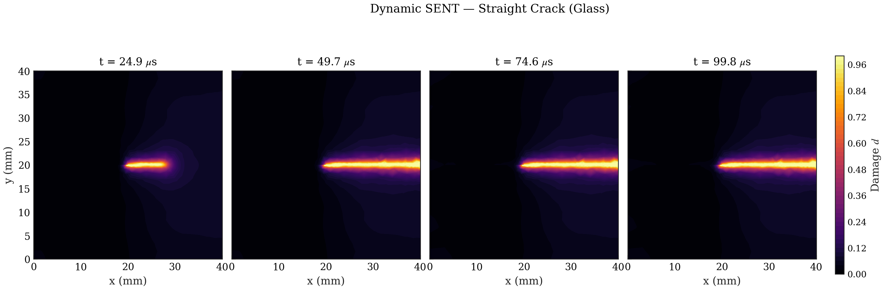

# B3 Dynamic SENT

## What This Example Solves

Dynamic single-edge-notched tension baseline verification example. The YAML is
runnable and the folder includes lightweight CSV, PNG, GIF, and MP4 outputs
from the current curated SENT result.

## Run

Run commands from the repository root:

```bash
python -m phast run examples/dynamic/B3_dynamic_sent/config.yaml --validate-only
python -m phast run examples/dynamic/B3_dynamic_sent/config.yaml --output_dir runs/B3_dynamic_sent
```

## YAML And Manual Setup

`config.yaml` defines the mesh, material parameters, dynamic loading, explicit
solver controls, and requested public outputs. No equivalent `run_fluent.py` is
currently promoted for this example; use the YAML deck as the public
reproduction path.

## Promoted Result

| Initial conditions | Damage evolution |
| --- | --- |
|  |  |

Required public artifacts are `config.yaml`, `run_manifest.json`,
`visual_manifest.json`, `initial_conditions.png`, `thumbnail.png`,
`damage_multipanel.png`, `damage_evolution.gif`, `damage_evolution.mp4`,
`history.csv`, `energy.csv`, and `crack_tip.csv`.

## Claim Boundary

Treat the current configuration as qualitative unless a finer public result is
promoted. The schema validation warning about `h/l0` is recorded in
`run_manifest.json`.
