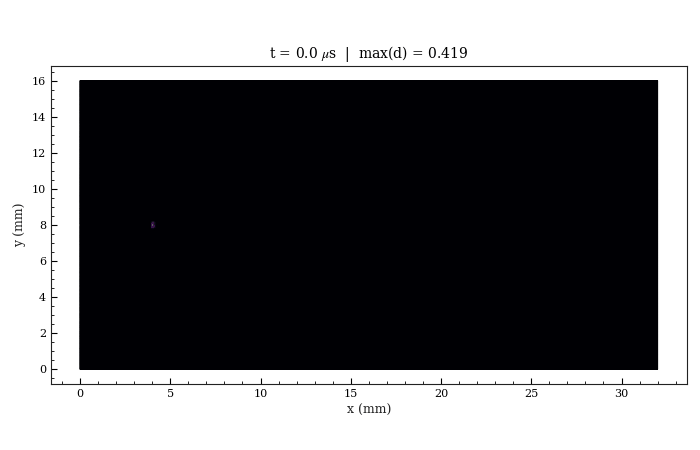

# B5 PMMA Branching

Selected PMMA dynamic crack-branching case based on Bleyer, Roux-Langlois, and Molinari (2017). The reference bundle uses the `dU = 0.05 mm` accelerated-compute run and keeps only lightweight public artifacts in this flat example folder.

All public-facing artifacts for this example stay directly in this folder. Full run folders, heavy trajectory stores, generated `mesh.msh`, external COMSOL model files, and diagnostic outputs are intentionally excluded.

## 1. Problem Description

- 32 mm x 16 mm PMMA plate with a 4 mm wedge notch and fine right-half branching band.
- Material model: PMMA, AT1 phase field, Amor split, plane stress, explicit dynamics.
- Loading: two-step prestrain followed by dynamic release with symmetric vertical displacement prescription.
- Claim boundary: visual PMMA crack-path evidence from the selected public run; the archived metadata does not report an automatic branch step.

The YAML configuration is the primary public input for this example. The retained reference run used 949,210 nodes, 1,894,256 elements, 19,001 explicit steps, and an A100 80 GB GPU. Do not regenerate the full benchmark during lightweight contract checks.


## Run The YAML Configuration

From the repository root:

```bash
python -m pip install -e .
python -m phast doctor
python -m phast run examples/dynamic/B5_pmma_branching/config.yaml --validate-only
```

Run the full YAML configuration only when you intend to regenerate the dynamic result bundle:

```bash
python -m phast run examples/dynamic/B5_pmma_branching/config.yaml \
  --output_dir examples/dynamic/B5_pmma_branching/run_local
```

For a short local configuration check, keep the validation path above or use the runner's available CLI overrides in a temporary output directory:

```bash
python -m phast run examples/dynamic/B5_pmma_branching/config.yaml \
  --num_steps 5 \
  --output_dir examples/dynamic/B5_pmma_branching/run_quick
```

Do not treat the short check as benchmark evidence; it is only a quick check for the declarative configuration and runner plumbing.

To regenerate a mesh from the public geometry recipe:

```bash
gmsh examples/dynamic/B5_pmma_branching/mesh.geo \
  -2 -format msh2 \
  -o examples/dynamic/B5_pmma_branching/mesh.msh
```

The public folder keeps `mesh.geo` but not `mesh.msh`; the generated mesh is large and the YAML path can compile the declarative geometry when a full rerun is required. Gmsh version and import/export settings can produce small node/element-count differences from the retained reference metadata.

## How The YAML Is Used

`python -m phast run ...` reads `config.yaml`, validates the schema, applies any CLI overrides, resolves the configuration file into runtime objects, writes the resolved config into the output directory, and then starts the explicit dynamic solver. The main YAML blocks map to runtime setup as follows:

| YAML block | Runtime meaning |
| --- | --- |
| `problem` | Human-readable problem name and reference text saved into logs and metadata. |
| `acceptance` | Claim-boundary or validation metadata when present; it does not define the PDE solve. |
| `geometry` | Mesh generator, geometry DSL, named regions, notch/hole definitions, and mesh-size controls. |
| `material` | Elastic, fracture, density, phase-field, split, and plane-stress settings used to build material objects. |
| `boundary_conditions` | Named mesh groups mapped to fixed, prescribed, traction, symmetry, or phase-field constraints. |
| `initial_conditions` | Optional pre-crack or damage preseeding, when the benchmark requires it. |
| `loading` | Time horizon, dynamic load protocol, impact/prestrain/traction ramp, and step controls. |
| `solver` | Explicit dynamics settings such as `solver_type`, `dt_safety`, damage cadence, and solver options. |
| `output` | Requested trajectories, CSV histories, plots, animations, print cadence, and fast-output settings. |

Use YAML for reproduction, review, and batch/accelerated compute execution because the configuration file is the artifact hashed into lockfiles and copied with run outputs.

## Run Without YAML

Use `run_fluent.py` when you want to assemble the same explicit-dynamics model directly through Python instead of loading the YAML configuration:

```bash
python examples/dynamic/B5_pmma_branching/run_fluent.py \
  --output-dir examples/dynamic/B5_pmma_branching/run_fluent
```

For a short local check, pass an explicit step count:

```bash
python examples/dynamic/B5_pmma_branching/run_fluent.py \
  --num-steps 5 \
  --output-dir examples/dynamic/B5_pmma_branching/run_fluent_quick
```

The YAML configuration remains the reference public reproduction input because it is the artifact used by release manifests and lockfiles.

## How Manual Setup Works

Manual setup means creating the same objects that the YAML runner creates for you:

| Manual step | Equivalent YAML block |
| --- | --- |
| Choose benchmark name, reference, and claim boundary | `problem` and optional `acceptance` |
| Define geometry, mesh source, refinement, holes/notches, and named groups | `geometry` |
| Set `E`, `nu`, `Gc`, `l0`, density, split, model, residual stiffness, and plane-stress mode | `material` |
| Apply fixed, symmetry, prescribed displacement, traction, and phase-field constraints | `boundary_conditions` |
| Seed a pre-crack or initial damage field when required | `initial_conditions` |
| Define impact, traction, or prestrain release protocol and total simulation time | `loading` |
| Choose explicit dynamics settings and damage cadence | `solver` |
| Request CSV histories, trajectories, plots, manifests, and animations | `output` |
| Run the simulation | `python -m phast run <config.yaml>` or the matching Python runner |

The Python runner builds the same mesh, material, boundary-condition, solver, and output objects as the YAML workflow.

## Reference Result

| Initial conditions | Damage evolution |
|---|---|
|  |  |

| Quantity | Reference evidence | Status |
| --- | --- | --- |
| Recorded run | Selected `dU = 0.05 mm` PMMA branching reference run | PRESENT |
| Branch metadata | Automatic branch-step detection was not triggered in the archived metadata | DOCUMENTED |
| Public evidence | Setup image, final damage image, damage animation, history, energy, crack-tip CSV, manifests, and run metadata | PRESENT |

The checked-in result bundle is intentionally compact. It includes the files needed to inspect the setup and reference response, while large trajectory stores and raw run directories are regenerated locally when needed.
