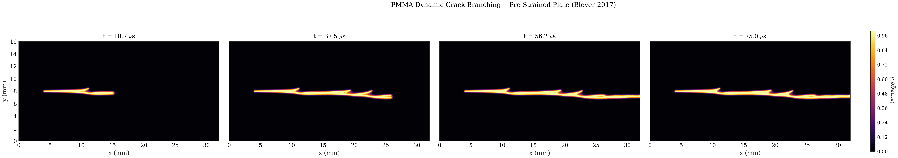

# B5 PMMA Branching

## What This Example Solves

Selected PMMA dynamic crack-path parametric-study result from the Bleyer-style
setup. This public folder retains the representative runnable deck and curated
visual-evidence bundle; raw parametric-study archives and trajectory stores
remain outside git.

## Run

Run commands from the repository root:

```bash
python -m phast run examples/dynamic/B5_pmma_branching/config.yaml --validate-only
python -m phast run examples/dynamic/B5_pmma_branching/config.yaml --output_dir runs/B5_pmma_branching
```

## YAML And Manual Setup

`config.yaml` defines the geometry, PMMA material parameters, dynamic loading,
explicit solver controls, and requested public outputs. No equivalent
`run_fluent.py` is currently promoted for this example; use the YAML deck as
the public reproduction path.

## Promoted Result

| Initial conditions | Damage evidence |
| --- | --- |
|  |  |

Required public artifacts are `config.yaml`, `run_manifest.json`,
`visual_manifest.json`, `initial_conditions.png`, `thumbnail.png`,
`damage_final.png`, `damage_multipanel.png`, `damage_profiles_multi.png`,
`space_time_diagram.png`, `compare.png`, `history.csv`, `energy.csv`, and
`crack_tip.csv`.

## Claim Boundary

The archived metadata did not record an automatic `branch_step`; keep that
provenance visible in `run_manifest.json` and use the promoted damage figures as
the visual evidence rather than claiming a detected branch time.
