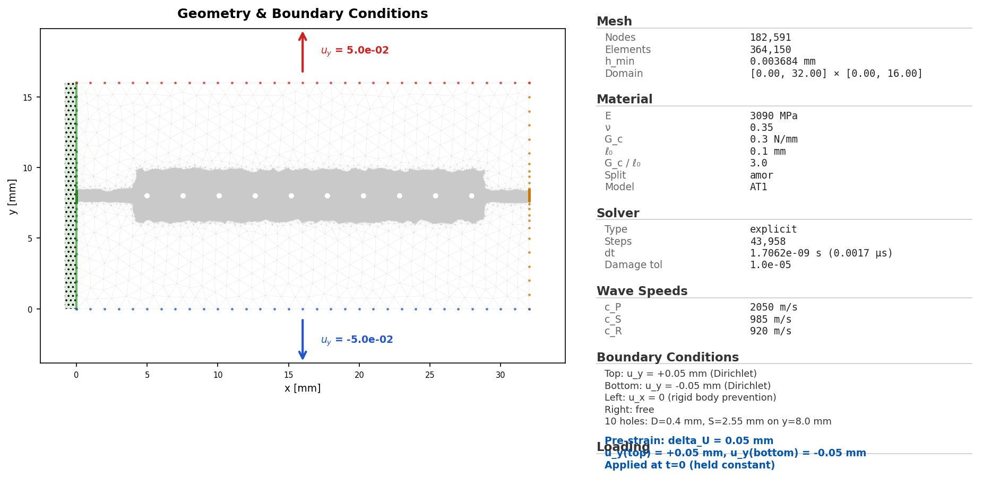
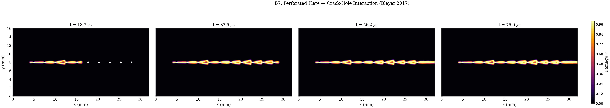

# B6 Perforated 10-Hole Plate

## What This Example Solves

Curated PMMA perforated-plate dynamic-fracture variant with ten holes. This
folder is flat by design and contains the YAML input deck plus curated
lightweight outputs from reviewed reference run 8585.

## Run

Run commands from the repository root:

```bash
python -m phast run examples/dynamic/B6_perforated_10holes/config.yaml --validate-only
python -m phast run examples/dynamic/B6_perforated_10holes/config.yaml --output_dir runs/B6_perforated_10holes
```

## YAML And Manual Setup

`config.yaml` defines the perforated geometry, PMMA material parameters,
dynamic loading, explicit solver controls, and requested public outputs. No
equivalent `run_fluent.py` is currently promoted for this example; use the YAML
deck as the public reproduction path.

## Promoted Result

| Initial conditions | Damage evolution |
| --- | --- |
|  |  |

Required public artifacts are `config.yaml`, `run_manifest.json`,
`visual_manifest.json`, `initial_conditions.png`, `thumbnail.png`,
`damage_multipanel.png`, `damage_final.png`, `damage_evolution.gif`,
`history.csv`, `energy.csv`, and `crack_tip.csv`.

Large trajectory stores and full run directories are generated on demand and
are not included in the public examples tree.
