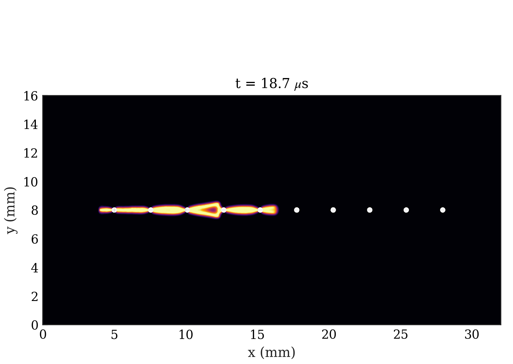

# B6 Perforated 10-Hole Plate

Curated PMMA perforated-plate dynamic fracture variant based on the Bleyer et al. (2017) crack-hole interaction setup. This public B6 folder retains the 10-hole case and lightweight artifacts from the reference run.

All public-facing artifacts for this example stay directly in this folder. Full run folders, heavy trajectory stores, external COMSOL model files, and diagnostic outputs are intentionally excluded.

## 1. Problem Description

- 32 mm x 16 mm PMMA SENT plate with ten holes and public B6 naming.
- Hole layout: 10 holes with 2.55 mm spacing, spanning x = 5.0 mm to x = 27.9 mm; hole diameter is 0.4 mm.
- Material model: PMMA, AT1 phase field, Amor split, plane stress, explicit dynamics.
- Loading: two-step prestrain to 0.05 mm followed by dynamic release with the Dirichlet displacement held fixed.
- Claim boundary: curated B6 crack-hole interaction evidence, not a separate convergence-quality validation gate.

The YAML configuration is the canonical public input for this example. The retained reference run used 182,591 nodes, 364,150 elements, 43,958 explicit steps, and an A100 80 GB GPU. Do not regenerate the full benchmark during lightweight contract checks.

## Run The Canonical YAML Configuration

From the repository root:

```bash
python -m pip install -e .
python -m phast doctor
python -m phast run examples/dynamic/B6_perforated_10holes/config.yaml --validate-only
```

Run the full YAML configuration only when you intend to regenerate the dynamic result bundle:

```bash
python -m phast run examples/dynamic/B6_perforated_10holes/config.yaml \
  --output_dir examples/dynamic/B6_perforated_10holes/run_local
```

For a short local configuration check, keep the validation path above or use the runner's available CLI overrides in a temporary output directory:

```bash
python -m phast run examples/dynamic/B6_perforated_10holes/config.yaml \
  --num_steps 5 \
  --output_dir examples/dynamic/B6_perforated_10holes/run_quick
```

Do not treat the short check as benchmark evidence; it is only a quick check for the declarative configuration and runner plumbing.

To regenerate a mesh from the public geometry recipe:

```bash
gmsh examples/dynamic/B6_perforated_10holes/mesh.geo \
  -2 -format msh2 \
  -o examples/dynamic/B6_perforated_10holes/mesh.msh
```

The checked-in `mesh.msh` is retained so the example can rerun without remeshing. Regenerating from `mesh.geo` is useful for reruns, but Gmsh version and import/export choices can produce small node/element-count differences from the retained reference metadata.

## How The YAML Is Used

`python -m phast run ...` reads `config.yaml`, validates the schema, applies any CLI overrides, resolves the configuration file into runtime objects, writes the resolved config into the output directory, and then starts the explicit dynamic solver. The main YAML blocks map to runtime setup as follows:

| YAML block | Runtime meaning |
| --- | --- |
| `problem` | Human-readable problem name and reference text saved into logs and metadata. |
| `geometry` | `perforated_sent` generator settings: plate dimensions, notch, hole count, spacing or placement, and mesh sizes. |
| `material` | PMMA elastic, fracture, density, AT1, Amor split, residual-stiffness, and plane-stress settings. |
| `boundary_conditions` | Left-edge x constraint and top/bottom prescribed vertical displacement constraints. |
| `loading` | Two-step prestrain protocol, retained displacement level, and dynamic release horizon. |
| `solver` | Explicit dynamics settings such as `solver_type` and `dt_safety`. |
| `output` | Requested trajectory, CSV, print-cadence, and fast-output settings. |

Use YAML for reproduction, review, and batch/accelerated compute execution because the configuration file is the artifact hashed into lockfiles and copied with run outputs.

## Run Without YAML

Use `run_fluent.py` when you want to assemble the same explicit-dynamics model directly through Python instead of loading the YAML configuration:

```bash
python examples/dynamic/B6_perforated_10holes/run_fluent.py \
  --output-dir examples/dynamic/B6_perforated_10holes/run_fluent
```

For a short local check, pass an explicit step count:

```bash
python examples/dynamic/B6_perforated_10holes/run_fluent.py \
  --num-steps 5 \
  --output-dir examples/dynamic/B6_perforated_10holes/run_fluent_quick
```

The YAML configuration remains the canonical public reproduction input because it is the artifact used by release manifests and lockfiles.

## How Manual Setup Works

Manual setup means creating the same objects that the YAML runner creates for you:

| Manual step | Equivalent YAML block |
| --- | --- |
| Choose benchmark name, reference, and claim boundary | `problem` |
| Define the SENT plate, notch, hole layout, boundary names, and mesh sizing | `geometry` |
| Set `E`, `nu`, `Gc`, `l0`, density, split, model, residual stiffness, and plane-stress mode | `material` |
| Apply left-edge x constraint and top/bottom vertical displacement constraints | `boundary_conditions` |
| Define two-step prestrain and dynamic-release duration | `loading` |
| Choose explicit dynamics settings | `solver` |
| Request CSV histories, trajectories, plots, manifests, and animations | `output` |
| Execute through `python -m phast run` | CLI run command |

The Python runner builds the same mesh, material, boundary-condition, solver, and output objects as the YAML workflow.

## Reference Result

| Initial conditions | Damage evolution |
|---|---|
|  |  |

| Quantity | Reference evidence | Status |
| --- | --- | --- |
| Recorded run | Retained B6 reference run; 182,591 nodes, 364,150 elements, 43,958 explicit steps | PRESENT |
| Hole layout | 10 holes with 2.55 mm spacing, spanning x = 5.0 mm to x = 27.9 mm | DOCUMENTED |
| Public evidence | Setup image, final damage image, damage animation, history, energy, crack-tip CSV, manifests, and run metadata | PRESENT |

The public result bundle is lightweight by design. It is suitable for documentation, review, and drift checks, while large full trajectories and source datasets remain outside the public example folder.
