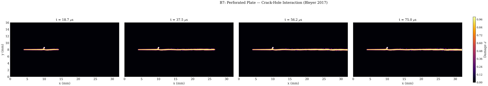

# B6 Perforated 1-Hole Far Plate

Curated PMMA dynamic fracture variant with a single far crack-path hole from the Bleyer et al. (2017) perforated-plate family. The public folder keeps the YAML deck and lightweight reference run

All public-facing artifacts for this example stay directly in this folder. Full run folders, heavy trajectory stores, external COMSOL model files, and diagnostic diagnostics are intentionally excluded.

## What This Example Solves

- 32 mm x 16 mm PMMA SENT plate with one hole at the far-hole placement.
- Material model: PMMA, AT1 phase field, Amor split, plane stress, explicit dynamics.
- Loading: two-step prestrain to 0.04 mm and dynamic release.
- Claim boundary: curated B6 variant evidence, not a separate reference validation gate.

The YAML deck is the canonical public input for this example. Expected runtime depends strongly on mesh size, device, and output cadence; the checked-in outputs are curated evidence and should not be regenerated during lightweight contract checks.

## Files

| File | Purpose |
| --- | --- |
| `README.md` | This contract-shaped public example guide. |
| `config.yaml` | Canonical YAML input deck for `python -m phast run`. |
| `run_fluent.py` | Equivalent Python/manual setup using `phast.Problem` and public config dataclasses. |
| `crack_tip.csv` | Crack-tip tracking output. |
| `crack_velocity_vs_position.png` | Reference PNG visual: crack velocity vs position. |
| `crack_velocity_vs_time.png` | Reference PNG visual: crack velocity vs time. |
| `damage_final.png` | Reference PNG visual: damage final. |
| `damage_multipanel.png` | Reference PNG visual: damage multipanel. |
| `damage_profile.png` | Reference PNG visual: damage profile. |
| `damage_profiles_multi.png` | Reference PNG visual: damage profiles multi. |
| `displacement_multipanel.png` | Reference PNG visual: displacement multipanel. |
| `dissipation_rate.png` | Reference PNG visual: dissipation rate. |
| `dissipation_vs_velocity.png` | Reference PNG visual: dissipation vs velocity. |
| `energy.csv` | Dynamic energy history output. |
| `energy_balance.png` | Reference PNG visual: energy balance. |
| `energy_normalized.png` | Reference PNG visual: energy normalized. |
| `history.csv` | Lightweight history output with damage/history/reaction fields. |
| `initial_conditions.png` | Reference PNG visual: initial conditions. |
| `max_damage_vs_time.png` | Reference PNG visual: max damage vs time. |
| `mesh.geo` | Gmsh geometry source retained for mesh provenance. |
| `mesh.msh` | Generated mesh retained so the example can rerun without remeshing when required. |
| `run_lockfile.json` | Reproducibility lockfile with resolved config and execution metadata. |
| `run_manifest.json` | Public manifest describing curated source, status, and included artifact list when available. |
| `run_metadata.json` | Run metadata for the included output set. |
| `space_time_diagram.png` | Reference PNG visual: space time diagram. |
| `stress_max_principal_multipanel.png` | Reference PNG visual: stress max principal multipanel. |
| `thumbnail.png` | Reference PNG visual: thumbnail. |
| `velocity_with_holes.png` | Reference PNG visual: velocity with holes. |
| `visual_manifest.json` | Manifest for reference visual artifacts. |

## Run The Canonical YAML Deck

From the repository root:

```bash
python -m pip install -e .
python -m phast doctor
python -m phast run examples/dynamic/B6_perforated_1hole_far/config.yaml --validate-only
```

Run the full YAML deck only when you intend to regenerate the dynamic result bundle:

```bash
python -m phast run examples/dynamic/B6_perforated_1hole_far/config.yaml \
  --output_dir examples/dynamic/B6_perforated_1hole_far/run_local
```

For a short local configuration check, keep the validation path above or use the runner's available CLI overrides in a temporary output directory:

```bash
python -m phast run examples/dynamic/B6_perforated_1hole_far/config.yaml \
  --num_steps 5 \
  --output_dir examples/dynamic/B6_perforated_1hole_far/run_quick
```

Do not treat the short check as benchmark evidence; it is only a quick check for the input deck and runner plumbing.

## How The YAML Is Used

`python -m phast run ...` reads `config.yaml`, validates the schema, applies any CLI overrides, resolves the deck into runtime objects, writes the resolved config into the output directory, and then starts the explicit dynamic solver. The main YAML blocks map to runtime setup as follows:

| YAML block | Runtime meaning |
| --- | --- |
| `problem` | Human-readable problem name and reference text saved into logs and metadata. |
| `acceptance` | Claim-boundary or validation metadata when present; it does not define the PDE solve. |
| `geometry` | Mesh generator, geometry DSL, named regions, notch/hole definitions, and mesh-size controls. |
| `material` | Elastic, fracture, density, phase-field, split, and plane-stress settings used to build material objects. |
| `boundary_conditions` | Named mesh groups mapped to fixed, prescribed, traction, symmetry, or phase-field constraints. |
| `initial_conditions` | Optional pre-crack or damage preseeding, when the benchmark requires it. |
| `loading` | Time horizon, dynamic load protocol, impact/prestrain/traction ramp, and step controls. |
| `solver` | Explicit dynamics settings such as `solver_type`, `dt_safety`, damage cadence, and solver options. |
| `output` | Requested trajectories, CSV histories, plots, animations, print cadence, and fast-output settings. |

Use YAML for reproduction, review, and batch/accelerated compute execution because the deck is the artifact hashed into lockfiles and copied with run outputs.

## Run Without YAML

Use `run_fluent.py` when you want to assemble the same explicit-dynamics model directly through Python instead of loading the YAML deck:

```bash
python examples/dynamic/B6_perforated_1hole_far/run_fluent.py \
  --output-dir examples/dynamic/B6_perforated_1hole_far/run_fluent
```

For a short local check, pass an explicit step count:

```bash
python examples/dynamic/B6_perforated_1hole_far/run_fluent.py \
  --num-steps 5 \
  --output-dir examples/dynamic/B6_perforated_1hole_far/run_fluent_quick
```

The YAML deck remains the canonical public reproduction input because it is the artifact used by release manifests and lockfiles.

## How Manual Setup Works

Manual setup means creating the same objects that the YAML runner creates for you:

| Manual step | Equivalent YAML block |
| --- | --- |
| Choose benchmark name, reference, and claim boundary | `problem` and optional `acceptance` |
| Define geometry, mesh source, refinement, holes/notches, and named groups | `geometry` |
| Set `E`, `nu`, `Gc`, `l0`, density, split, model, residual stiffness, and plane-stress mode | `material` |
| Apply fixed, symmetry, prescribed displacement, traction, and phase-field constraints | `boundary_conditions` |
| Seed a pre-crack or initial damage field when required | `initial_conditions` |
| Define impact, traction, or prestrain release protocol and total simulation time | `loading` |
| Choose explicit dynamics settings and damage cadence | `solver` |
| Request CSV histories, trajectories, plots, manifests, and animations | `output` |
| Execute through `python -m phast run` | CLI run command |

The Python runner builds the same mesh, material, boundary-condition, solver, and output objects as the YAML workflow.

## Reference Result

| Initial conditions | Damage evolution |
|---|---|
|  |  |

| Quantity | Reference evidence | Status |
| --- | --- | --- |
| Recorded run | Selected reference run | PRESENT |
| Hole layout | 1 hole at x = 10.0 mm from run metadata | DOCUMENTED |
| Public evidence | Setup, final/multipanel damage, field diagnostics, history, energy, and crack-tip CSVs | PRESENT |

The public result bundle is lightweight by design. It is suitable for documentation, review, and drift checks, while large full trajectories and source datasets remain outside the public example folder.
