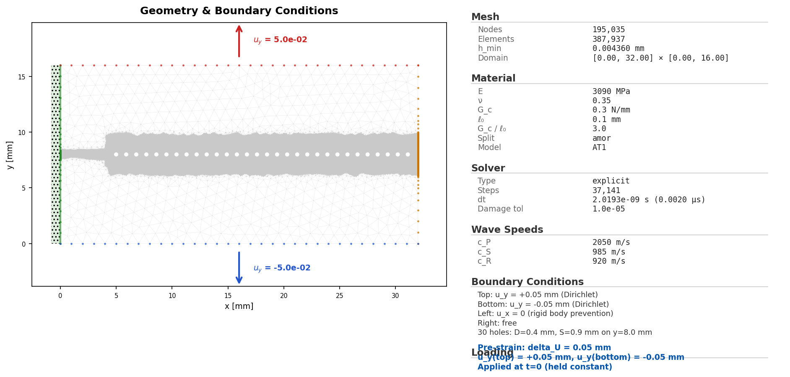
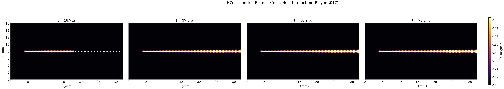

# B6 Perforated 30-Hole Plate

## What This Example Solves

Selected perforated PMMA plate dynamic-fracture example with thirty holes. This
flat public-candidate folder uses the public B6 naming and retains curated
lightweight outputs.

## Run

Run commands from the repository root:

```bash
python -m phast run examples/dynamic/B6_perforated_30holes/config.yaml --validate-only
python -m phast run examples/dynamic/B6_perforated_30holes/config.yaml --output_dir runs/B6_perforated_30holes
```

## YAML And Manual Setup

`config.yaml` defines the perforated geometry, PMMA material parameters,
dynamic loading, explicit solver controls, and requested public outputs. No
equivalent `run_fluent.py` is currently promoted for this example; use the YAML
deck as the public reproduction path.

## Promoted Result

| Initial conditions | Damage evolution |
| --- | --- |
|  |  |

Required public artifacts are `config.yaml`, `run_manifest.json`,
`visual_manifest.json`, `initial_conditions.png`, `thumbnail.png`,
`damage_final.png`, `damage_multipanel.png`, `damage_evolution.gif`,
`damage_evolution.mp4`, `history.csv`, `energy.csv`, and `crack_tip.csv`.

## Related Variants

Related public B6 variants are `B6_perforated_10holes`,
`B6_perforated_1hole_near`, and `B6_perforated_1hole_far`.
