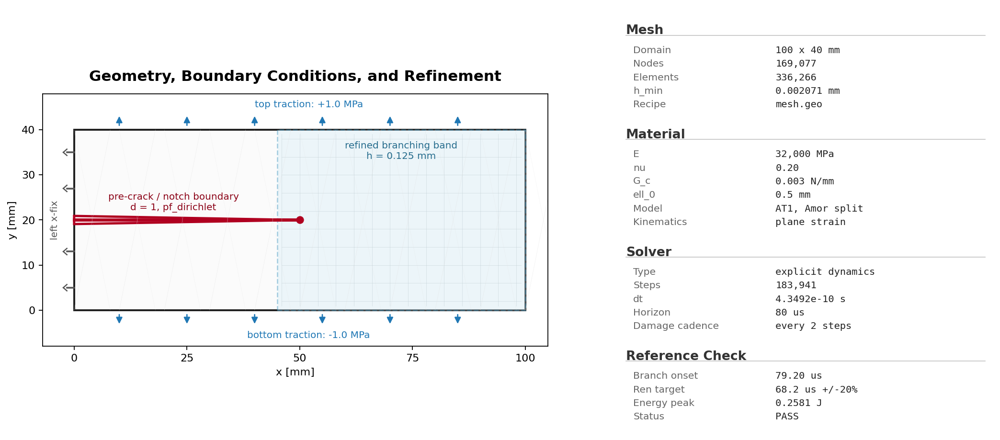

# B7 Dynamic Crack Branching COMSOL Cross-Check

Dynamic crack branching cross-check against the COMSOL 6.4 Application Library setup and a Ren/Borden-style timing window. The public folder contains the YAML configuration, Python fluent runner, Gmsh geometry recipe, curated visual evidence, comparison files, and sanitized metadata.

All public-facing artifacts for this example stay directly in this folder. Full run folders, heavy trajectory stores, external COMSOL model files, and vendor documentation are intentionally excluded.

## 1. Problem Description

- 100 mm x 40 mm full-plate equivalent of the COMSOL half-plate dynamic branching setup.
- Pre-crack: central notch from the left edge to x = 50 mm at y = 20 mm, represented by a damage preseed and a phase-field Dirichlet constraint on `notch.boundary`.
- Material model: AT1 phase field with Amor split, using the glass-like parameter values recorded in `config.yaml`.
- Loading: smooth-ramped top and bottom Neumann traction, with opposite signs on the two horizontal edges.
- Claim boundary: beta cross-check evidence; the Ren/Borden-style branch timing window is the public acceptance target, while the COMSOL Application Library timing is retained as secondary reference context.

The YAML configuration is the canonical public input for this example. The retained reference run used 169,077 nodes, 336,266 elements, 183,941 explicit steps, and an A100 80 GB GPU. Do not regenerate the full benchmark during lightweight contract checks.


## Run The Canonical YAML Configuration

From the repository root:

```bash
python -m pip install -e .
python -m phast doctor
python -m phast run examples/dynamic/B7_dynamic_crack_branching_comsol/config.yaml --validate-only
```

Run the full YAML configuration only when you intend to regenerate the dynamic result bundle:

```bash
python -m phast run examples/dynamic/B7_dynamic_crack_branching_comsol/config.yaml \
  --output_dir examples/dynamic/B7_dynamic_crack_branching_comsol/run_local
```

For a short local configuration check, keep the validation path above or use the runner's available CLI overrides in a temporary output directory:

```bash
python -m phast run examples/dynamic/B7_dynamic_crack_branching_comsol/config.yaml \
  --num_steps 5 \
  --output_dir examples/dynamic/B7_dynamic_crack_branching_comsol/run_quick
```

Do not treat the short check as benchmark evidence; it is only a quick check for the declarative configuration and runner plumbing.

To regenerate a mesh from the public geometry recipe:

```bash
gmsh examples/dynamic/B7_dynamic_crack_branching_comsol/mesh.geo \
  -2 -format msh2 \
  -o examples/dynamic/B7_dynamic_crack_branching_comsol/mesh.msh
```

The public folder keeps `mesh.geo` rather than a checked-in `mesh.msh`. A full run can regenerate or cache the mesh from the geometry recipe; Gmsh version and import/export choices can produce small node/element-count differences from the retained reference metadata.

## How The YAML Is Used

`python -m phast run ...` reads `config.yaml`, validates the schema, applies any CLI overrides, resolves the configuration file into runtime objects, writes the resolved config into the output directory, and then starts the explicit dynamic solver. The main YAML blocks map to runtime setup as follows:

| YAML block | Runtime meaning |
| --- | --- |
| `problem` | Human-readable problem name and reference text saved into logs and metadata. |
| `acceptance` | Reference timing and energy checks recorded for the public cross-check; it does not define the PDE solve. |
| `geometry` | 100 mm x 40 mm plate, triangular notch, named edges, and refined branching band. |
| `material` | Elastic constants, density, fracture toughness, length scale, AT1 model, Amor split, and residual stiffness. |
| `boundary_conditions` | Top/bottom Neumann tractions, left-edge x constraint, and phase-field constraint on the notch boundary. |
| `initial_conditions` | Initial damage preseed on `notch.boundary`. |
| `loading` | Smooth traction ramp, 80 us time horizon, and automatic CFL-based step count. |
| `solver` | Explicit dynamics settings such as `solver_type`, `dt_safety`, projected-CG bounds handling, and damage cadence. |
| `output` | Requested trajectory, CSV, print-cadence, and fast-output settings. |

Use YAML for reproduction, review, and batch/accelerated compute execution because the configuration file is the artifact hashed into lockfiles and copied with run outputs.

## Run Without YAML

Use `run_fluent.py` when you want to assemble the same explicit-dynamics model directly through Python instead of loading the YAML configuration:

```bash
python examples/dynamic/B7_dynamic_crack_branching_comsol/run_fluent.py \
  --output-dir examples/dynamic/B7_dynamic_crack_branching_comsol/run_fluent
```

For a short local check, pass an explicit step count:

```bash
python examples/dynamic/B7_dynamic_crack_branching_comsol/run_fluent.py \
  --num-steps 5 \
  --output-dir examples/dynamic/B7_dynamic_crack_branching_comsol/run_fluent_quick
```

The YAML configuration remains the canonical public reproduction input because it is the artifact used by release manifests and lockfiles.

## How Manual Setup Works

Manual setup means creating the same objects that the YAML runner creates for you:

| Manual step | Equivalent YAML block |
| --- | --- |
| Choose benchmark name, reference, and claim boundary | `problem` and optional `acceptance` |
| Define geometry, mesh source, refinement, holes/notches, and named groups | `geometry` |
| Set `E`, `nu`, `Gc`, `l0`, density, split, model, residual stiffness, and plane-stress mode | `material` |
| Apply fixed, symmetry, prescribed displacement, traction, and phase-field constraints | `boundary_conditions` |
| Seed a pre-crack or initial damage field when required | `initial_conditions` |
| Define impact, traction, or prestrain release protocol and total simulation time | `loading` |
| Choose explicit dynamics settings and damage cadence | `solver` |
| Request CSV histories, trajectories, plots, manifests, and animations | `output` |
| Execute through `python -m phast run` | CLI run command |

The Python runner builds the same mesh, material, boundary-condition, solver, and output objects as the YAML workflow.

## Reference Result

| Initial conditions | Damage evolution |
|---|---|
|  |  |

| Quantity | Reference evidence | Status |
| --- | --- | --- |
| Recorded run | Retained B7 reference run; 169,077 nodes, 336,266 elements, 183,941 explicit steps | PRESENT |
| Branching onset | 79.20 us against the 68.2 us Ren timing target with 20% tolerance | PASS |
| Elastic energy peak | 0.2581 J against the 0.26-0.28 J reference window | PASS |
| Public evidence | Setup image, final damage image, damage animation, comparison plots, CSV/text reference files, manifests, and run metadata | PRESENT |
| Excluded large files | COMSOL model files, vendor documentation, heavy trajectories, and full run directories stay outside this folder | ENFORCED |

The public result bundle is lightweight by design. It is suitable for documentation, review, and drift checks, while large full trajectories and source datasets remain outside the public example folder.
