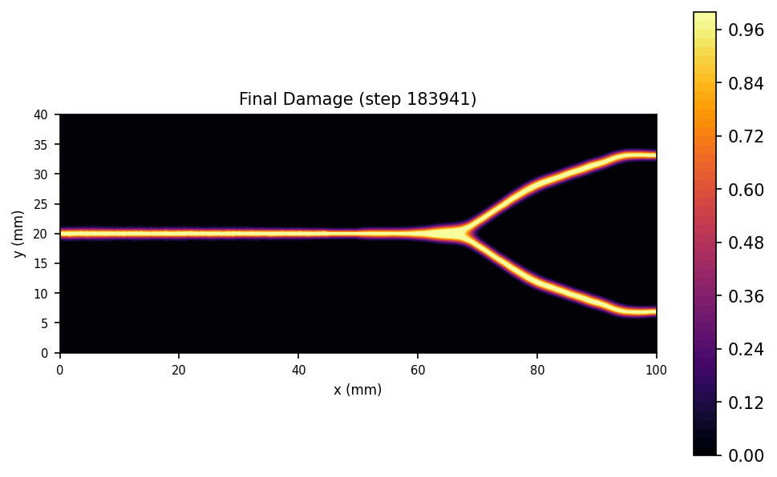

# B7 Dynamic Crack Branching COMSOL Cross-Check

## What This Example Solves

Accepted dynamic crack-branching comparison package. This folder includes the
runnable YAML, curated PNG/CSV/report metadata, and links to the vendor
reference instead of distributing COMSOL binary model files or vendor PDFs.

## Run

Run commands from the repository root:

```bash
python -m phast run examples/dynamic/B7_dynamic_crack_branching_comsol/config.yaml --validate-only
python -m phast run examples/dynamic/B7_dynamic_crack_branching_comsol/config.yaml --output_dir runs/B7_dynamic_crack_branching_comsol
```

## YAML And Manual Setup

`config.yaml` defines the dynamic branching setup, material parameters,
explicit solver controls, comparison artifacts, and requested public outputs.
No equivalent `run_fluent.py` is currently promoted for this example; use the
YAML deck as the public reproduction path.

## Promoted Result

| Initial conditions | Damage evolution |
| --- | --- |
|  |  |

Required public artifacts are `config.yaml`, `run_manifest.json`,
`visual_manifest.json`, `animation_manifest.json`, `initial_conditions.png`,
`thumbnail.png`, `damage_final.png`, `damage_evolution.gif`,
`damage_evolution.mp4`, `energy.png`, `compare.png`, `compare_report.txt`,
`comsol_energy_curve.csv`, and `comsol_branching_times.txt`.

## Reference And Claim Boundary

The vendor reference is COMSOL's [Phase-Field Modeling of Dynamic Crack
Branching](https://www.comsol.com/model/phase-field-modeling-of-dynamic-crack-branching-131361)
Application Gallery model. The animation was regenerated from the retained
reference trajectory for run `b7_branching_47961`; the raw trajectory is not
distributed with the public repository.
