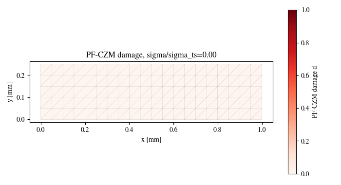

# PF-CZM Uniaxial Strength Validation

Forward Wu PF-CZM damage-law strength calibration and length-scale validation
for a uniaxial bar. This retained result validates the damage-law threshold and
bounded nonlinear solve; it is not a full structural crack-growth, mixed-mode
delamination, or ductile PF-plasticity-cohesive benchmark.

## What This Validation Covers

- Model: Wu PF-CZM cohesive phase-field damage law.
- Geometry: small uniaxial bar mesh.
- Target tensile strength: `sigma_ts = 3.0`.
- Length scales: `l0 = 0.08`, `0.12`, `0.18`.
- Validation gates: peak degraded stress matches target strength, damage onset
  occurs near `sigma_ts`, nonlinear residuals are finite/bounded, and visual
  artifacts pass review checks.

| Initial conditions | Damage evolution |
|---|---|
|  |  |

## Files

| File | Purpose |
| --- | --- |
| `README.md` | This guide. |
| `config.yaml` | Resolved validation configuration saved with the retained result. |
| `summary.json` | Validation metrics, capability boundary, strength errors, solver status, and pass/fail status. |
| `mesh.geo` | Gmsh geometry source. |
| `mesh.msh` | Generated mesh used by the retained result. |
| `results.csv` | Load/displacement and damage response table. |
| `history.csv` | History output for the validation run. |
| `energy.csv` | Energy ledger for the retained run. |
| `solver_telemetry.csv` | Solver residual and iteration telemetry. |
| `timing_per_step.csv` | Per-step timing evidence. |
| `initial_conditions.png` | Initial setup visual. |
| `damage_final.png` | Final damage field. |
| `load_displacement.png` | Load-displacement response. |
| `damage_history.png` | Damage-history plot. |
| `energy_split.png` | Energy split diagnostic. |
| `convergence.png` | Nonlinear convergence plot. |
| `mesh_deformed.png` | Deformed mesh visual. |
| `damage_evolution.gif` | Lightweight damage evolution animation. |
| `visual_manifest.json` | Visual artifact dimensions and review status. |
| `run_manifest.json` | Retained result manifest. |
| `run_metadata.json` | Runtime and platform metadata. |
| `run_lockfile.json` | Resolved configuration and reproducibility metadata. |

artifact.

## Run Through The Reproducibility Contract

From the repository root:

```bash
python -m phast run configs/benchmarks/plasticity_interface/reproducibility_contracts.yaml \
  --validation-id pfczm_uniaxial_strength \
  --output_dir examples/plasticity_interface/results/pfczm_uniaxial_strength
```

For direct script execution:

```bash
python examples/plasticity_interface/run_pfczm_uniaxial_strength_validation.py \
  --output-dir outputs/plasticity_interface/pfczm_uniaxial_strength
```

## Manual Or Fluent Setup

The script-contract runner is canonical for this beta validation slice. The
fluent authoring companion is:

```text
examples/plasticity_interface/fluent_setups/pfczm_uniaxial_strength.py
```

It constructs the same conceptual problem using `phast.Problem`, but public
reproduction should use the reproducibility contract command above.

## Reference Result

| Quantity | Value | Status |
| --- | ---: | --- |
| Target tensile strength | `3.0` | PASS |
| Max peak strength relative error | `1.20e-4` | PASS |
| Damage onset ratio | `1.016 * sigma_ts` | PASS |
| All solvers converged | true | PASS |
| Max residual norm | `1.12e-7` | PASS |
| Visual manifest | passed | PASS |
| Validation | passed | PASS |

