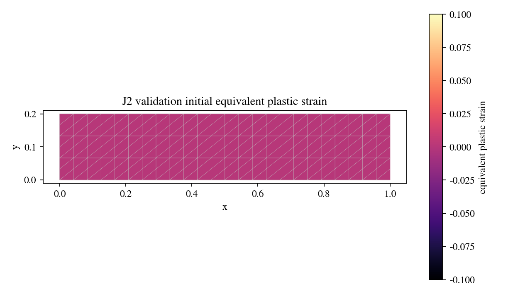
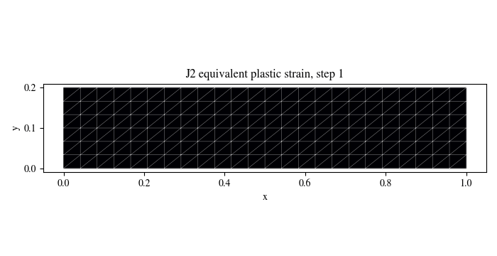

# J2 Plasticity Validation

Standalone J2/von-Mises material-point validation with linear isotropic
hardening. This retained result validates the return-mapping kernel and
stress-strain response; it is not a coupled phase-field plasticity solve.

## What This Validation Covers

- Constitutive model: small-strain J2/von-Mises plasticity.
- Hardening: linear isotropic hardening.
- Elastic parameters: `E = 210000 MPa`, `nu = 0.30`.
- Yield stress: `250 MPa`.
- Hardening modulus: `5000 MPa`.
- Loading: axial load/unload path over 66 steps.
- Validation gate: post-yield consistency relation
  `sigma_vm = sigma_y0 + H * eps_p_eq`.

| Initial conditions | Field evolution |
|---|---|
|  |  |


## Run Through The Reproducibility Contract

From the repository root:

```bash
python -m phast run configs/benchmarks/plasticity_interface/reproducibility_contracts.yaml \
  --validation-id j2_validation \
  --output_dir examples/plasticity_interface_beta/results/j2_validation
```

For direct script execution:

```bash
python examples/plasticity_interface_beta/run_j2_validation.py \
  --output-dir outputs/plasticity_interface/j2_validation
```

## Manual Or Fluent Setup

The script-contract runner is reference for this beta validation slice. The
fluent authoring companion is:

```text
examples/plasticity_interface_beta/fluent_setups/j2_validation.py
```

It constructs the same conceptual problem using `phast.Problem`, but public
reproduction should use the reproducibility contract command above.

## Reference Result

| Quantity | Value | Status |
| --- | ---: | --- |
| Plastic steps | 51 / 66 | PASS |
| First yield step | 16 | PASS |
| Max yield residual | `8.53e-14 MPa` | PASS |
| Visual manifest | passed | PASS |
| Validation | passed | PASS |

