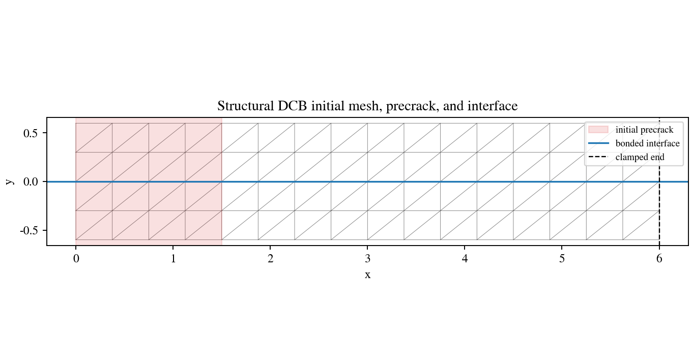
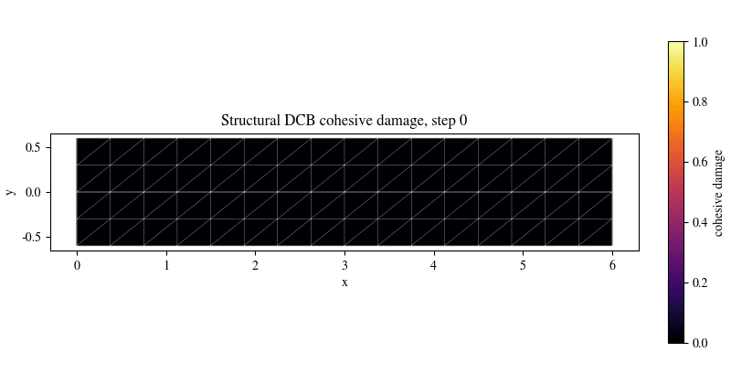

# Structural DCB Cohesive Validation

DCB-style Mode-I structural cohesive delamination validation with a precrack,
free bulk degrees of freedom, post-peak softening, damage-front tracking, and
energy diagnostics. This is a solver-coupled structural baseline validation, not
ASTM D5528 material-property data reduction.

## What This Validation Covers

- Geometry: two-arm DCB-style specimen with a bonded zero-thickness interface.
- Cohesive law: bilinear traction-separation interface.
- Loading: clamped-end Mode-I opening.
- Solver path: sparse cohesive Newton path through the cohesive operator hook.
- Validation gates: convergence, post-peak softening, monotone cohesive
  dissipation, front advance, bounded diagnostic energy gap, and visual review.

| Initial conditions | Damage evolution |
|---|---|
|  |  |


## Run Through The Reproducibility Contract

From the repository root:

```bash
python -m phast run configs/benchmarks/plasticity_interface/reproducibility_contracts.yaml \
  --validation-id structural_dcb_cohesive \
  --output_dir examples/plasticity_interface_beta/results/structural_dcb_cohesive
```

For direct script execution:

```bash
python examples/plasticity_interface_beta/run_structural_dcb_cohesive_benchmark.py \
  --output-dir outputs/plasticity_interface/structural_dcb_cohesive
```

## Manual Or Fluent Setup

The script-contract runner is canonical for this beta validation slice. The
fluent authoring companion is:

```text
examples/plasticity_interface_beta/fluent_setups/structural_dcb_cohesive.py
```

It constructs the same conceptual problem using `phast.Problem`, but public
reproduction should use the reproducibility contract command above.

## Reference Result

| Quantity | Value | Status |
| --- | ---: | --- |
| Nodes / elements | 102 / 128 | PASS |
| Cohesive elements | 12 | PASS |
| Max residual norm | `1.24e-10` | PASS |
| Peak opening force | `2.0585` | PASS |
| Final delamination front | `x = 3.75` | PASS |
| Post-peak softening | true | PASS |
| Energy gap fraction | `0.106` with `0.15` tolerance | PASS |
| Validation | passed | PASS |

The claim remains scoped to structural cohesive baseline validation. It does not
claim ASTM D5528 data reduction or calibrated engineering fracture toughness.

