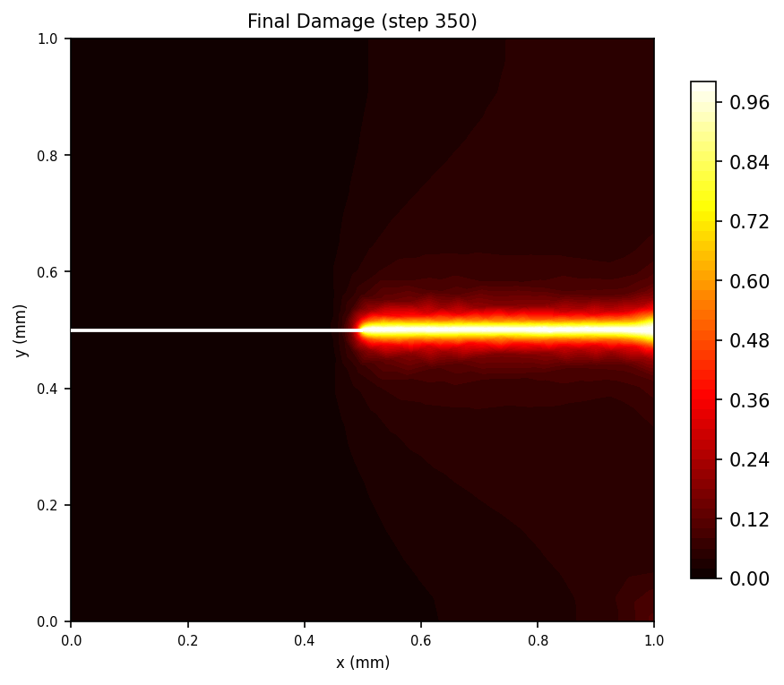
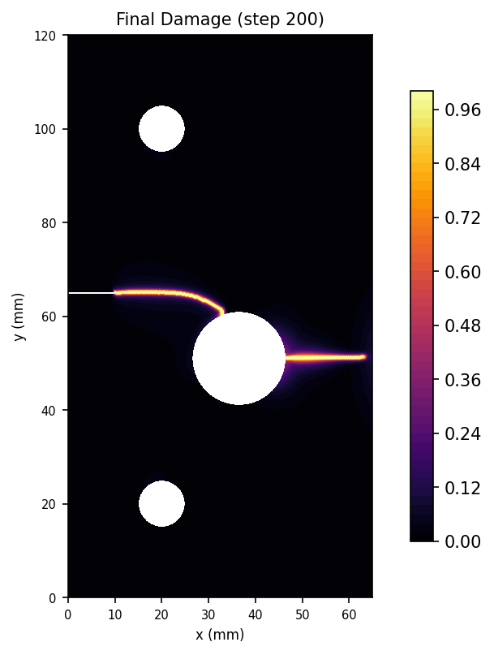

# Quasi-static Examples

Curated quasi-static examples that can be run directly from YAML. Each folder
contains a customer-facing `config.yaml`, promoted validation artifacts, and a
short README with the exact command.

| Folder | Benchmark | Run command | Validation |
|---|---|---|---|
| `miehe_tension/` | Miehe single-edge-notched tension, PhaseFieldX 1711 | `python -m phast run examples/quasistatic/miehe_tension/config.yaml --output_dir runs/miehe_tension` | Peak reaction error `1.08%`; overall PASS |
| `notched_holed_plate/` | COMSOL notched-holed plate, Ambati et al. | `python -m phast run examples/quasistatic/notched_holed_plate/config.yaml --output_dir runs/notched_holed_plate` | First peak `4.68%`, displacement `9.09%`, second peak `10.51%`; overall PASS |

## Visuals

| Example | Final damage | Evolution |
|---|---|---|
| Miehe SENT |  |  |
| Notched-holed plate |  |  |

## User workflow

Validate first:

```bash
python -m phast run examples/quasistatic/miehe_tension/config.yaml --validate-only
python -m phast run examples/quasistatic/notched_holed_plate/config.yaml --validate-only
```

Run with the default Zarr trajectory store:

```bash
python -m phast run examples/quasistatic/miehe_tension/config.yaml \
  --output_dir runs/miehe_tension
```

Override trajectory storage when needed:

```bash
python -m phast run examples/quasistatic/miehe_tension/config.yaml \
  --trajectory --trajectory-format both \
  --output_dir runs/miehe_tension_both
```

## Folder contract

Each public example should keep:

- `README.md`
- `PROMOTION.md`
- `config.yaml`
- `mesh.geo` and `mesh.msh`
- lightweight CSV, JSON, log, and comparison files
- representative PNG/MP4 visuals

Heavy trajectory stores such as `training_data.zarr/` and `training_data.h5`
are generated by the YAML run and are intentionally not committed here.
