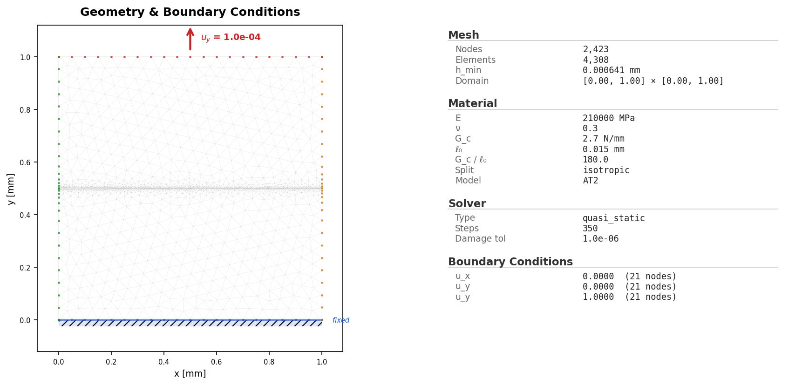
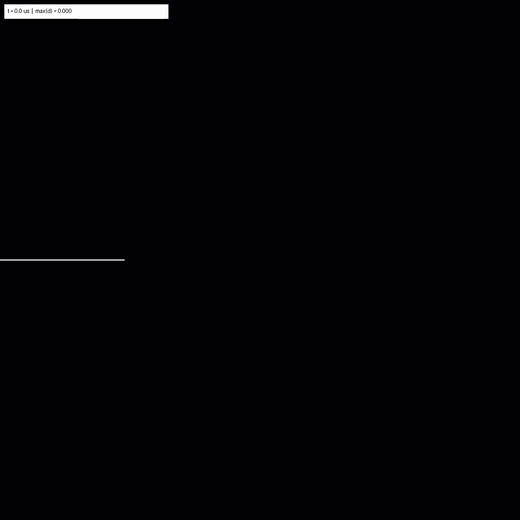

# Quasi-static Miehe SENT

Validated single-edge-notched tension benchmark based on Miehe et al. (2010)
and the PhaseFieldX 1711 reference response.

This folder is self-contained: the canonical YAML configuration, equivalent
Python fluent example, mesh files, validation report, run metadata, CSV outputs,
and reference visual artifacts are kept beside each other.

## What This Example Solves

This is the Miehe single-edge-notched tension benchmark:

- Square plate with side length `L = 1.0`.
- Edge notch length `a = 0.5`.
- Phase-field length scale `l0 = 0.015`.
- Refined crack-region element size `h_crack = 0.001875`.
- Far-field element size `h_coarse = 0.05`.
- Material parameters: `E = 210000`, `nu = 0.3`, `Gc = 2.7`.
- Phase-field model: AT2.
- Energy split: isotropic.
- Boundary conditions: bottom fixed in `x` and `y`; top prescribed in `y`.
- Loading schedule: 50 steps to `0.005`, then 300 steps to `0.008`.
- Solver: quasi-static staggered mechanics/damage solve with Jacobi
  preconditioning and multigrid enabled.

The checked-in reference result used 350 load steps on CPU and took about
905 seconds in the recorded run metadata.

## Files

| File | Purpose |
| --- | --- |
| `config.yaml` | Canonical simulation input deck. Defines geometry, material, boundary conditions, loading, solver settings, device, and output options. |
| `run_fluent.py` | Equivalent Python example using the fluent PhAST API instead of a YAML deck. |
| `mesh.geo` | Gmsh geometry source for the notched plate, named physical curves, and refinement fields. |
| `mesh.msh` | Generated Gmsh mesh used by the reference example. |
| `README.md` | This guide. |
| `run_manifest.json` | Public artifact manifest for the flat example bundle. |
| `run_metadata.json` | Compact run summary: platform, package/runtime versions, material, mesh size, solver settings, runtime, peak reaction, and memory. |
| `run_lockfile.json` | Reproducibility lockfile containing the command, config hash, resolved config, runtime metadata, and solver/material/mesh metadata. |
| `results.csv` | Per-step displacement, reaction force, max damage, max history field, stagger iterations, and elapsed time. |
| `history.csv` | Per-step fracture/history values, reaction force, and applied displacement. |
| `energy.csv` | Per-step elastic, fracture, kinetic, external, and total energy. |
| `timing_per_step.csv` | Per-step timing output. |
| `solver_telemetry.csv` | Solver iterations, residuals, time step, and line-search telemetry. |
| `crack_tip.csv` | Crack-tip tracking output. |
| `compare_report.txt` | Text validation report against the PhaseFieldX 1711 reference response. |
| `compare.png` | Load-displacement comparison against reference data. |
| `load_displacement.png` | Simulation load-displacement curve. |
| `energy.png` | Energy component plot. |
| `staggered_convergence.png` | Staggered-solver convergence plot. |
| `initial_conditions.png` | Initial setup and damage-state visual. |
| `damage_final.png` | Final damage field. |
| `thumbnail.png` | Thumbnail image for catalogs and docs. |
| `damage_evolution.gif` | Damage evolution animation. |
| `damage_evolution.mp4` | MP4 damage evolution animation. |
| `visual_manifest.json` | Manifest for reference visual artifacts, dimensions, sizes, and review status. |

## Run The Canonical YAML Deck

From the repository root:

```bash
python -m pip install -e .
python -m phast doctor
python -m phast run examples/quasistatic/miehe_tension/config.yaml --validate-only
```

Run the full reference setup:

```bash
python -m phast run examples/quasistatic/miehe_tension/config.yaml \
  --output_dir examples/quasistatic/miehe_tension/run_local
```

For a quick local check, override the number of steps:

```bash
python -m phast run examples/quasistatic/miehe_tension/config.yaml \
  --num_steps 5 \
  --output_dir examples/quasistatic/miehe_tension/run_quick
```

The YAML deck is the canonical public input for exact reproduction because it
is the artifact saved into the lockfile and validation evidence.

### How The YAML Is Used

`python -m phast run ...` reads `config.yaml`, validates the schema, applies any
CLI overrides, resolves the input deck into runtime objects, writes a resolved
copy of the config into the output directory, and then starts the staggered
solver. The main YAML blocks map to solver setup as follows:

| YAML block | Runtime meaning |
| --- | --- |
| `problem` | Human-readable problem name and reference text printed in logs and saved into metadata. |
| `acceptance` | Validation metadata for the reference benchmark; it does not define the PDE solve. |
| `geometry` | Selects the mesh source. Here it calls the built-in `miehe_tension` mesh generator with the listed parameters. |
| `material` | Defines elastic and fracture material parameters used to build the `Material` object. |
| `boundary_conditions` | Maps mesh node sets such as `bottom` and `top` to fixed or prescribed displacement constraints. |
| `loading` | Defines the load schedule. Here `cyclic_phases: "0.005:50,0.008:300"` means 50 steps to displacement 0.005, then 300 steps to 0.008. |
| `solver` | Configures the quasi-static staggered mechanics/damage solver, tolerances, iteration limits, preconditioner, and backend. |
| `output` | Chooses which CSV files, plots, trajectories, profiles, and animations are written. |
| `device` | Selects CPU/CUDA/MPS behavior. This reference deck is CPU by default. |
| `initial_conditions` | Optional damage preseeding; this deck leaves it unset. |

Use YAML when the goal is reproducibility, review, record keeping, or batch execution.
It gives a stable text input that can be hashed, copied into the output
directory, and compared across machines.

## Run Without YAML

Use `run_fluent.py` when you want to see how the same simulation is assembled
directly through the Python solver API:

```bash
python examples/quasistatic/miehe_tension/run_fluent.py \
  --output-dir examples/quasistatic/miehe_tension/run_fluent
```

For a short check:

```bash
python examples/quasistatic/miehe_tension/run_fluent.py \
  --num-steps 5 \
  --output-dir examples/quasistatic/miehe_tension/run_fluent_quick
```

The fluent script constructs:

1. A `phast.Problem`.
2. The built-in `miehe_tension` geometry.
3. Named regions mapped from mesh physical groups.
4. Material parameters for the AT2 phase-field model.
5. Bottom displacement constraints and top prescribed displacement.
6. A quasi-static cyclic loading step.
7. Staggered solver settings.
8. Requested trajectory, history, plot, profile, and animation outputs.

The fluent path is useful for learning, prototyping, and programmatic problem
generation. For published reproduction, prefer `config.yaml`.

### How Manual Setup Works

Manual setup means creating the same objects that the YAML runner would create
for you:

| Manual step | Equivalent YAML block |
| --- | --- |
| `phast.Problem("Miehe SENT")` | `problem.name` |
| `.geometry("miehe_tension", ...)` | `geometry.type` and `geometry.parameters` |
| `.region(...)` | Named regions used to connect mesh groups to materials, loads, and outputs |
| `.material(...)` | `material` |
| `.boundary_condition(...)` | `boundary_conditions` |
| `.analysis_step(...)` | `loading` plus the quasi-static analysis type |
| `.solver(...)` | `solver` |
| `.outputs(...)` | `output` |
| `.device("cpu")` | `device.device` |
| `.run(output_dir=...)` | The execution call normally made by `python -m phast run` |

In other words, the YAML route is declarative and file-based; the fluent route
is programmatic and object-based. They are meant to describe the same physical
problem.

## Equivalent Fluent API

The script below is the same authoring shape used in `run_fluent.py`.

```python
import phast

result = (
    phast.Problem("Miehe SENT")
    .geometry("miehe_tension", L=1.0, a=0.5, l0=0.015,
              h_crack=0.001875, h_coarse=0.05)
    .region("body", kind="domain")
    .region("bottom", from_mesh="bottom")
    .region("top", from_mesh="top")
    .material("glass", region="body", E=210000.0, nu=0.3,
              Gc=2.7, l0=0.015, rho=7.8e-09,
              eta_residual=1.0e-07, energy_split="isotropic",
              pf_model="AT2", plane_stress=False)
    .boundary_condition("fix", region="bottom", dof="x", name="clamp_x")
    .boundary_condition("fix", region="bottom", dof="y", name="clamp_y")
    .boundary_condition("displacement", region="top", dof="y",
                        value=1.0, name="pull_top")
    .analysis_step(
        "load",
        kind="quasi_static",
        controls={"protocol": "cyclic", "cyclic_phases": "0.005:50,0.008:300",
                  "num_steps": 350, "dt": 1.0},
        active_boundary_conditions=["clamp_x", "clamp_y", "pull_top"],
    )
    .solver("quasi_static", stagger_tol=1.0e-08, max_stagger=500,
            preconditioner="jacobi", backend="auto",
            fail_on_mechanics_nonconvergence=False)
    .outputs(
        fields=[{"name": "trajectory", "every": 1, "format": "zarr"}],
        histories=[{"name": "reaction_force", "region": "bottom", "dof": "y"}],
        plots=True,
        gif=True,
    )
    .run(output_dir="runs/miehe_tension", return_result=True)
)
```

## Lower-level Manual Setup

For solver development, the lower-level path is:

1. Construct a `ProblemConfig` object.
2. Fill `GeometryConfig`, `MaterialConfig`, `BoundaryConditionEntry`,
   `LoadingConfig`, `SolverSettings`, `OutputConfig`, and `DeviceConfig`.
3. Call `resolve_config(cfg)` to obtain the mesh, material, boundary
   conditions, solver config, device context, and loading schedule.
4. Instantiate `StaggeredSolver(mesh, mat, bcs, config=solver_cfg, ctx=ctx)`.
5. Loop over load steps, update the boundary-condition load factor, and call
   `solver.step_full()`.
6. Write outputs using the same helpers used by `python -m phast run`.

That path is intentionally more verbose and is mainly for solver development.
Most users should choose either the YAML deck or `run_fluent.py`.

## Reference Result

The current reference package is the checked-in reference output set.

| Initial conditions | Damage evolution |
|---|---|
|  |  |

| Quantity | Reference | Reference result | Status |
| --- | ---: | ---: | --- |
| Peak reaction | 0.7012 kN | 0.6936 kN, 1.08% error | PASS |
| Pre-peak L2 error | PhaseFieldX 1711 | 1.70% | PASS |
| Dissipated-energy error | PhaseFieldX 1711 | 5.38% | PASS |

The full snap-back branch is reported as informational only. Robust post-peak
traversal requires arc-length or another continuation strategy, so acceptance is
gated on the peak, pre-peak response, and dissipated energy.
