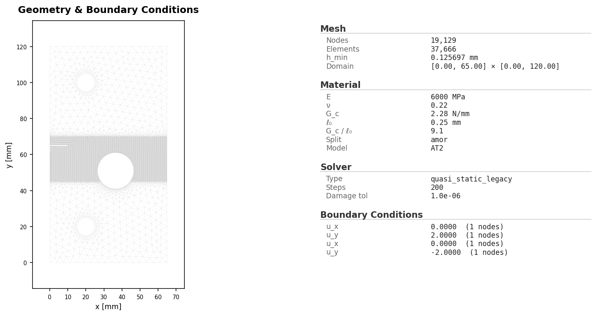
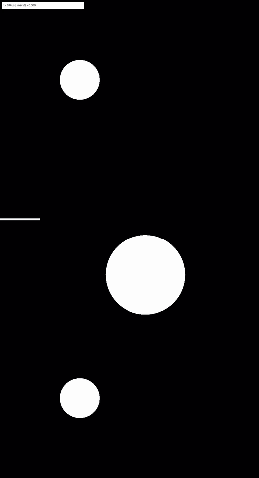

# Quasi-static Notched Holed Plate

Validated notched-holed plate benchmark based on the COMSOL 6.4 Geomechanics
Application Library example "Brittle Fracture of a Holed Plate" and the
Ambati, Gerasimov, and De Lorenzis phase-field fracture setup.

This folder is self-contained: the canonical YAML configuration, mesh files,
COMSOL reference curve, comparison script, validation report, CSV outputs, and
reference visual artifacts are kept beside each other.

## What This Example Solves

This is the COMSOL/Ambati notched-holed plate benchmark:

- Plate size: `65 mm x 120 mm`.
- Left notch: `10 mm x 0.5 mm`, centered near `y = 65 mm`.
- Large hole: center `(36.5, 51.0) mm`, radius `10 mm`.
- Upper and lower loading pins: centers `(20, 100) mm` and `(20, 20) mm`,
  radius `5 mm`.
- Mesh refinement: `h = 0.3 mm` near the notch/hole region and `h = 1.0 mm`
  near the loading pins.
- Material parameters: `E = 6000`, `nu = 0.22`, `Gc = 2.28`.
- Phase-field model: AT2.
- Energy split: Amor / volumetric-deviatoric.
- Plane-stress setting: `true`.
- Residual stiffness: `eta_residual = 1.0e-5`.
- Boundary conditions: upper and lower pin boundaries are tied to rigid
  connector master points; vertical displacements are prescribed symmetrically.
- Loading schedule: 140 steps to per-pin displacement `0.25 mm`, then
  60 steps to `1.0 mm`.
- Solver: quasi-static legacy staggered mechanics/damage solve with Jacobi
  preconditioning and damage update every 3 steps.

The checked-in reference result used 200 load steps on CPU and took about
10.5 hours in the recorded run metadata.

## Files

| File | Purpose |
| --- | --- |
| `README.md` | This guide. |
| `config.yaml` | Canonical simulation input deck. Defines geometry, material, rigid-connector boundary conditions, loading, solver settings, device, and output options. |
| `run_manifest.json` | Public artifact manifest for the flat example bundle. |
| `mesh.geo` | Gmsh geometry source for the plate, notch, hole, pins, named groups, and refinement fields. |
| `mesh.msh` | Generated Gmsh mesh used by the reference example. |
| `comsol_load_displacement.csv` | Lightweight COMSOL reference curve used by `compare.py`. |
| `compare.py` | Local comparison script for a newly generated run directory. |
| `compare_report.txt` | Text validation report against the COMSOL 6.4 reference values. |
| `compare.png` | Load-displacement comparison against the COMSOL reference curve. |
| `initial_conditions.png` | Initial setup and damage-state visual. |
| `damage_final.png` | Final damage field. |
| `damage_multipanel.png` | Damage snapshots across selected load steps. |
| `damage_evolution.gif` | Damage evolution animation for GitHub/docs preview. |
| `damage_evolution.mp4` | MP4 damage evolution animation. |
| `load_displacement.png` | Simulation load-displacement response. |
| `energy.png` | Energy component plot. |
| `results.csv` | Per-step displacement, reaction force, max damage, max history field, stagger iterations, and elapsed time. |
| `history.csv` | Coarser fracture/history output over selected steps. |
| `energy.csv` | Per-step elastic, fracture, kinetic, external, and total energy. |

Detailed logs, complete lockfiles, and large trajectory stores are supporting reproducibility artifacts rather than public-facing example files.

## Run The Canonical YAML Deck

From the repository root:

```bash
python -m pip install -e .
python -m phast doctor
python -m phast run examples/quasistatic/notched_holed_plate/config.yaml --validate-only
```

Run the full reference setup:

```bash
python -m phast run examples/quasistatic/notched_holed_plate/config.yaml \
  --output_dir examples/quasistatic/notched_holed_plate/run_local
```

For a short local check, override the number of steps:

```bash
python -m phast run examples/quasistatic/notched_holed_plate/config.yaml \
  --num_steps 5 \
  --output_dir examples/quasistatic/notched_holed_plate/run_quick
```

Compare a generated run against the COMSOL reference values:

```bash
python -u examples/quasistatic/notched_holed_plate/compare.py \
  --run-dir examples/quasistatic/notched_holed_plate/run_local
```

The YAML deck is the canonical public input for this example because it
contains the exact rigid-connector setup used for the reference validation run.

### How The YAML Is Used

`python -m phast run ...` reads `config.yaml`, validates the schema, applies any
CLI overrides, resolves the input deck into runtime objects, writes a resolved
copy of the config into the output directory, and then starts the staggered
solver. The main YAML blocks map to solver setup as follows:

| YAML block | Runtime meaning |
| --- | --- |
| `name` / `reference` | Human-readable problem name and reference text printed in logs and saved into metadata. |
| `acceptance` | Validation metadata for the reference benchmark; it does not define the PDE solve. |
| `geometry` | Defines the plate, notch, hole, pins, named groups, and mesh refinement through the geometry DSL. |
| `material` | Defines elastic and fracture material parameters used to build the `Material` object. |
| `boundary_conditions` | Creates rigid connectors from pin boundary nodes to master points and prescribes vertical pin displacement. |
| `loading` | Defines the load schedule. Here `cyclic_phases: "0.25:140,1.0:60"` means 140 steps to 0.25 mm per-pin displacement, then 60 steps to 1.0 mm. |
| `solver` | Configures the quasi-static legacy staggered solver, tolerances, iteration limits, damage cadence, preconditioner, and backend. |
| `output` | Chooses CSV files, plots, trajectory settings, profiling, and animation settings. |
| `device` | Selects CPU/CUDA/MPS behavior. This reference deck is CPU by default. |
| `initial_conditions` | Optional damage preseeding; this deck leaves it unset. |

Use YAML when the goal is reproducibility, review, record keeping, or batch
execution. It gives a stable text input that can be hashed, copied into the
output directory, and compared across machines.

## Run Without YAML

This example is currently YAML-first only. A `run_fluent.py` companion is not
included because the reference deck depends on the legacy quasi-static
rigid-connector path. The fluent API can describe the mesh regions and boundary
condition parameters, but the exact reference `quasi_static_legacy` execution
path is not yet exposed as a stable manual/API example.

For now, use `config.yaml` for exact reproduction and use the YAML blocks above
as the manual setup map.

### How Manual Setup Works

Manual setup means creating the same objects that the YAML runner creates for
you:

| Manual step | Equivalent YAML block |
| --- | --- |
| Choose the benchmark name and reference text | `name`, `reference` |
| Define the plate, notch, hole, pins, and mesh refinement | `geometry` |
| Set `E`, `nu`, `Gc`, `l0`, `eta_residual`, split, model, and plane-stress mode | `material` |
| Tie pin boundary node sets to master points using rigid connectors | `boundary_conditions` |
| Prescribe symmetric pin displacement and load schedule | `loading` |
| Choose staggered tolerances, damage cadence, preconditioner, and backend | `solver` |
| Request CSVs, plots, trajectory settings, and animation outputs | `output` |
| Choose CPU/CUDA/MPS | `device` |
| Execute through `python -m phast run` | CLI run command |

At the lower solver-development level, the sequence is: construct a
`ProblemConfig`, call `resolve_config(cfg)`, instantiate `StaggeredSolver` with
the resolved mesh/material/boundary-condition objects, loop over load steps, and
write outputs using the same helpers used by `python -m phast run`. That path is
intended for solver development, not public reproduction.

## Reference Result

The current reference package is the strict-parity matrix run for
`notched_holed_at2_h0.30_l0.25`.

| Initial conditions | Damage evolution |
|---|---|
|  |  |

| Quantity | Reference | Reference result | Status |
| --- | ---: | ---: | --- |
| First peak load | 0.63 kN | 0.6005 kN, 4.68% error | PASS |
| First peak displacement | 0.165 mm per pin | 0.1500 mm per pin, 9.09% error | PASS |
| Second peak load | 0.15 kN | 0.1342 kN, 10.51% error | PASS |

The crack-path comparison is qualitative against the COMSOL reference
morphology. The second peak is a post-peak diagnostic because it occurs after
crack reorientation toward the hole, where staggered tolerances,
crack-width-to-mesh ratio, and monolithic/staggered solver details affect the
response.
