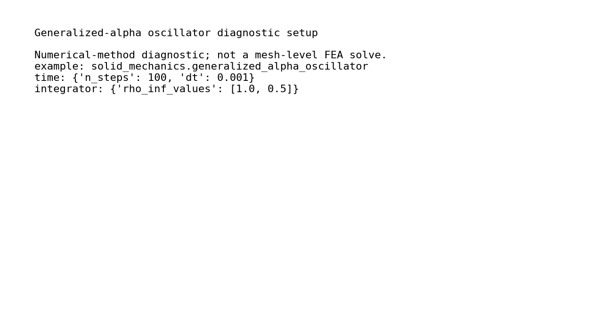
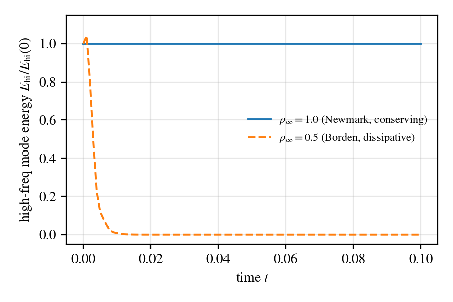

# Generalized-Alpha Oscillator

## What This Validation Covers

Two-degree-of-freedom oscillator integrated with the Hulbert-Chung generalized-alpha method. The example shows high-frequency numerical dissipation for `rho_inf = 0.5` while preserving the low-frequency mode, and is retained as a time-integration diagnostic rather than a mesh FEA tutorial.

## Files

| File | Purpose |
| --- | --- |
| `config.yaml` | Canonical diagnostic configuration. |
| `run_fluent.py` | Public Python/manual runner for config-driven execution. |
| `run.py` | Diagnostic implementation. |
| `response.csv`, `response.png` | Energy-history comparison. |
| `initial_conditions.png` | Diagnostic setup preview. |
| `thumbnail.png`, `visual_manifest.json` | Gallery thumbnail and visual QA metadata. |
| `run_lockfile.json`, `run_manifest.json` | Reproducibility metadata for the reference output. |

## Run Through The Reproducibility Contract

Run commands from the repository root:

```bash
python examples/solid_mechanics/generalized_alpha_oscillator/run.py
python examples/solid_mechanics/generalized_alpha_oscillator/run_fluent.py
```

Use `--output-dir <path>` with `run_fluent.py --run` for local reruns that should not overwrite the reference outputs.

## Manual Or Fluent Setup

```bash
python examples/solid_mechanics/generalized_alpha_oscillator/run_fluent.py --run --output-dir runs/generalized_alpha_oscillator
```

The runner loads `config.yaml`, sets a separate output directory, and calls the diagnostic implementation. This example does not include `mesh.geo` because it does not generate or solve a geometric mesh.

## Reference Result

| Initial conditions | Energy response |
| --- | --- |
|  |  |

| Metric | Reference value |
| --- | ---: |
| `rho_inf=1`, low-frequency energy ratio | `1.000000` |
| `rho_inf=1`, high-frequency energy ratio | `1.000000` |
| `rho_inf=0.5`, low-frequency energy ratio | `1.000000` |
| `rho_inf=0.5`, high-frequency energy ratio | `1.466e-25` |
