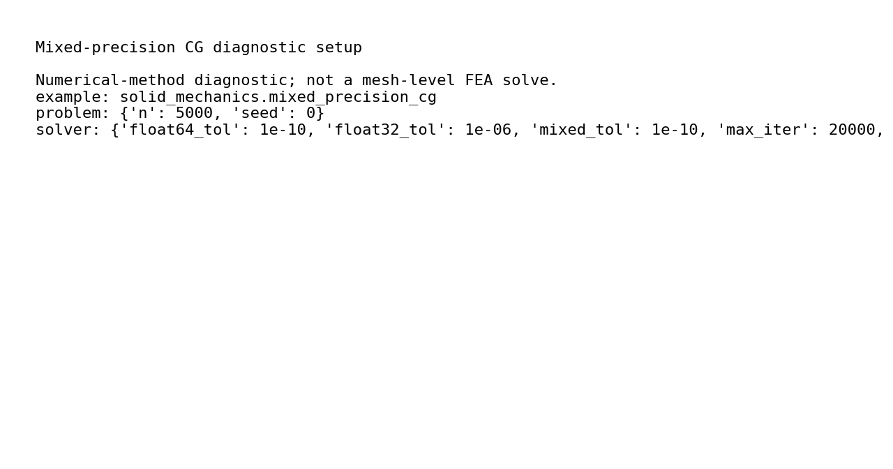
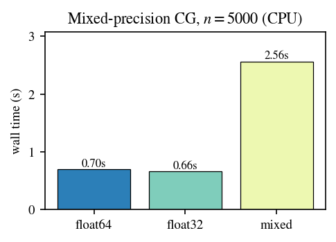

# Mixed-Precision CG

## What This Validation Covers

Conjugate-gradient numerics diagnostic on a sparse one-dimensional Laplacian. The example compares float64, float32, and mixed-precision behavior and is retained as a solver-kernel check rather than a mesh FEA tutorial.

## Files

| File | Purpose |
| --- | --- |
| `config.yaml` | Canonical diagnostic configuration. |
| `run_fluent.py` | Public Python/manual runner for config-driven execution. |
| `run.py` | Diagnostic implementation. |
| `response.csv`, `response.png` | Timing, residual, and error comparison. |
| `initial_conditions.png` | Diagnostic setup preview. |
| `thumbnail.png`, `visual_manifest.json` | Gallery thumbnail and visual QA metadata. |
| `run_manifest.json` | Reproducibility metadata for the reference output. |

## Run Through The Reproducibility Contract

Run commands from the repository root:

```bash
python examples/solid_mechanics/mixed_precision_cg/run.py
python examples/solid_mechanics/mixed_precision_cg/run_fluent.py
```

Use `--output-dir <path>` with `run_fluent.py --run` for local reruns that should not overwrite the reference outputs.

## Manual Or Fluent Setup

```bash
python examples/solid_mechanics/mixed_precision_cg/run_fluent.py --run --output-dir runs/mixed_precision_cg
```

The runner loads `config.yaml`, sets a separate output directory, and calls the diagnostic implementation. This example does not include `mesh.geo` because it does not generate or solve a geometric mesh.

## Reference Result

| Initial conditions | Precision comparison |
| --- | --- |
|  |  |

| Metric | Reference value |
| --- | ---: |
| float64 residual | `1.963e-08` |
| float32 residual | `1.006e+01` |
| mixed residual | `3.894e-10` |
| mixed iterations | `19705` |
