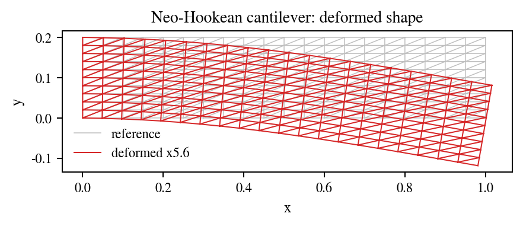

# Neo-Hookean Cantilever

## What This Example Solves

Compressible neo-Hookean cantilever solved by load-stepped Newton iteration with PhAST sparse linear solves. The example reports the load-displacement response, Newton iteration counts, differentiable final correction through `SparseSolveAutograd`, and final nonlinear field visualisations.

## Files

| File | Purpose |
| --- | --- |
| `config.yaml` | Canonical YAML deck for the public run. |
| `run_fluent.py` | Equivalent Python/manual authoring setup using `phast.Problem`. |
| `mesh.geo` | Public Gmsh geometry recipe for the rectangular cantilever mesh. |
| `run.py` | Compatibility wrapper used by the YAML runner. |
| `fluent_setup.py` | Legacy name retained for compatibility with earlier drafts. |
| `response.csv`, `response.png` | Load-displacement and Newton-response summary. |
| `initial_conditions.png` | Geometry and boundary-condition preview. |
| `deformed_shape.png`, `displacement_magnitude.png`, `displacement_final.png` | Displacement-field visual evidence. |
| `von_mises.png`, `stress_final.png`, `strain_final.png`, `strain_energy.png`, `jacobian.png` | Final stress, strain, energy, and deformation-gradient diagnostics. |
| `response_evolution.mp4`, `field_evolution.mp4` | Lightweight reference animations. |
| `thumbnail.png`, `visual_manifest.json` | Gallery thumbnail and visual QA metadata. |
| `run_manifest.json` | Reproducibility metadata for the reference output. |

## Run The Canonical YAML Deck

Run commands from the repository root:

```bash
python -m phast run examples/solid_mechanics/neohookean_plate/config.yaml --validate-only
python -m phast run examples/solid_mechanics/neohookean_plate/config.yaml
python examples/solid_mechanics/neohookean_plate/run_fluent.py
```

Use `--output_dir <path>` with `python -m phast run` for local reruns that should not overwrite the reference outputs.

## How The YAML Is Used

`mesh` defines the structured rectangular grid, `material` defines the compressible neo-Hookean constants, and `loading` defines the load stepping and displacement scale. The workflow lowers those blocks to the nonlinear solid-mechanics runner, which performs Newton iterations, writes final field plots, and records the load-response history.

## Run Without YAML

```bash
python examples/solid_mechanics/neohookean_plate/run_fluent.py --run --output-dir runs/neohookean_plate
```

`run_fluent.py` builds the same problem manually with `phast.Problem`: geometry, region, material, load step, solver selection, and requested outputs are all declared in Python before the workflow contract is validated.

## How Manual Setup Works

The manual setup mirrors the YAML fields directly: `.geometry(...)` maps to `mesh`, `.material(...)` maps to `material`, `.analysis_step(...)` maps to `loading`, `.solver(...)` selects `solid_mechanics.neohookean_plate`, and `.outputs(...)` requests the response and field artifacts.

## Reference Result

| Initial conditions | Response and deformed field |
| --- | --- |
|  |  |

| Metric | Reference value |
| --- | ---: |
| Final tip displacement | `-2.125e-02 m` |
| Linear beam estimate | `-2.500e-02 m` |
| Maximum Newton iterations | `3` |
| Minimum `det F` | `0.9956` |
