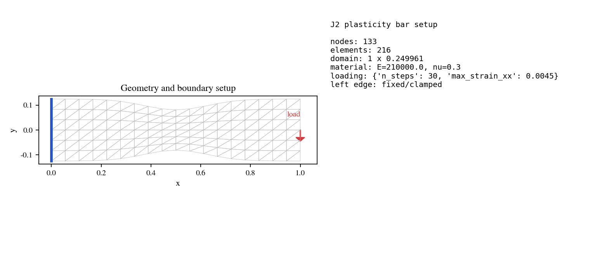
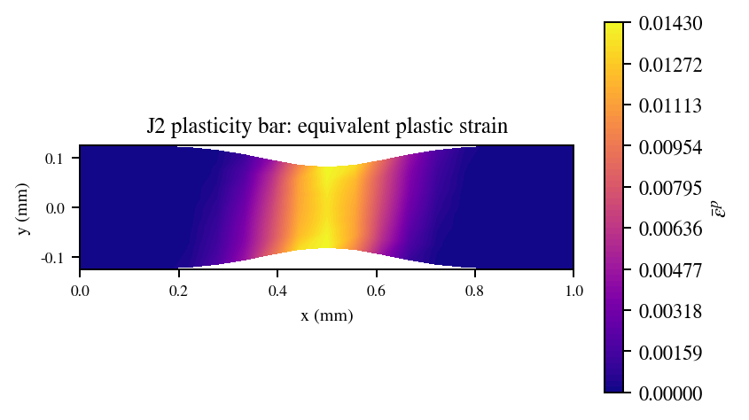

# J2 Bar

## 1. Problem Description

Mesh-level displacement-controlled J2/von-Mises plasticity with linear isotropic hardening. The example solves a mildly waisted bar, tracks equivalent plastic strain, and writes stress/plastic-strain fields for the reference public run.


## Run The Canonical YAML Configuration

Run commands from the repository root:

```bash
python -m phast run examples/solid_mechanics_beta/j2_bar/config.yaml --validate-only
python -m phast run examples/solid_mechanics_beta/j2_bar/config.yaml
python examples/solid_mechanics_beta/j2_bar/run_fluent.py
```

Use `--output_dir <path>` with `python -m phast run` for local reruns that should not overwrite the reference outputs.

## How The YAML Is Used

`mesh` defines the structured waisted bar, `material` defines the elastic constants, initial yield stress, and hardening modulus, and `loading` defines the number of displacement increments and maximum axial strain. The workflow lowers those blocks to the mesh J2 runner, which performs the elastoplastic solve and records the response and final plasticity fields.

## Run Without YAML

```bash
python examples/solid_mechanics_beta/j2_bar/run_fluent.py --run --output-dir runs/j2_bar
```

`run_fluent.py` builds the same problem manually with `phast.Problem`: geometry, region, material, load step, solver selection, and requested outputs are all declared in Python before the workflow contract is validated.

## How Manual Setup Works

The manual setup mirrors the YAML fields directly: `.geometry(...)` maps to `mesh`, `.material(...)` maps to `material`, `.analysis_step(...)` maps to `loading`, `.solver(...)` selects `solid_mechanics.j2_bar`, and `.outputs(...)` requests the response and field artifacts.

## Reference Result

| Initial conditions | Plastic strain field |
| --- | --- |
|  |  |

| Metric | Reference value |
| --- | ---: |
| Plastic steps | `25` |
| Final equivalent plastic strain | `3.278e-03` |
| Maximum von Mises stress | `325.65 MPa` |
| Maximum equivalent plastic strain | `1.513e-02` |
