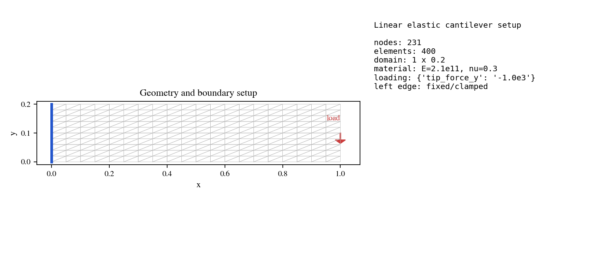
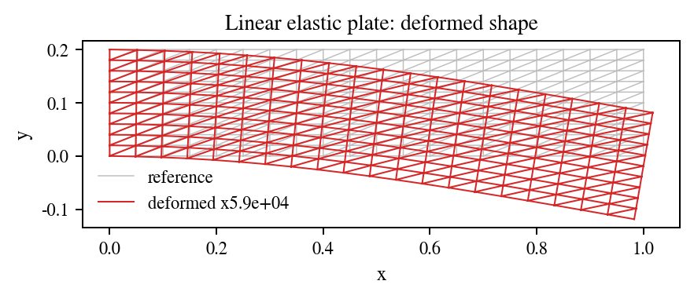

# Linear Elastic Plate

## 1. Problem Description

Plane-strain CST cantilever solved with PhAST's sparse autograd linear-solve path. The example compares the finite-element tip displacement against an Euler-Bernoulli estimate, differentiates the tip displacement with respect to Young's modulus, and writes standard displacement, stress, strain, and energy visualisations.


## Run The Canonical YAML Configuration

Run commands from the repository root:

```bash
python -m phast run examples/solid_mechanics_beta/linear_plate/config.yaml --validate-only
python -m phast run examples/solid_mechanics_beta/linear_plate/config.yaml
python examples/solid_mechanics_beta/linear_plate/run_fluent.py
```

Use `--output_dir <path>` with `python -m phast run` for local reruns that should not overwrite the reference outputs.

## How The YAML Is Used

`mesh` defines the structured rectangular grid, `material` defines the linear elastic constants, and `loading.tip_force_y` defines the applied tip load. The workflow lowers those blocks to the solid-mechanics example runner, which assembles the CST system, solves the sparse linear problem, writes field plots, and records the response history.

## Run Without YAML

```bash
python examples/solid_mechanics_beta/linear_plate/run_fluent.py --run --output-dir runs/linear_plate
```

`run_fluent.py` builds the same problem manually with `phast.Problem`: geometry, region, material, load step, solver selection, and requested outputs are all declared in Python before the workflow contract is validated.

## How Manual Setup Works

The manual setup mirrors the YAML fields directly: `.geometry(...)` maps to `mesh`, `.material(...)` maps to `material`, `.analysis_step(...)` maps to `loading`, `.solver(...)` selects `solid_mechanics.linear_plate`, and `.outputs(...)` requests the response and field artifacts.

## Reference Result

| Initial conditions | Response and deformed field |
| --- | --- |
|  |  |

| Metric | Reference value |
| --- | ---: |
| Tip displacement FE | `-2.024e-06 m` |
| Euler-Bernoulli estimate | `-2.381e-06 m` |
| Relative error | `-14.98 %` |
| Maximum von Mises stress | `1.141e+05 Pa` |
