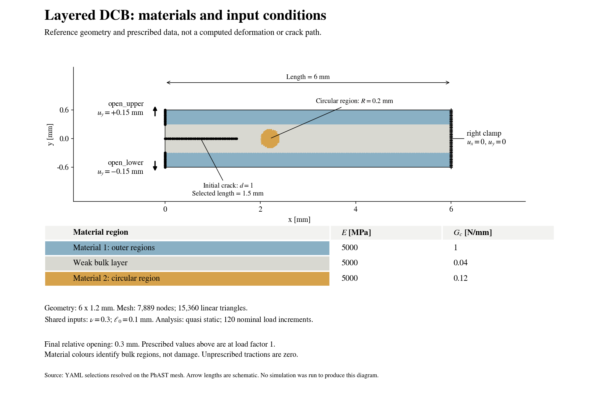
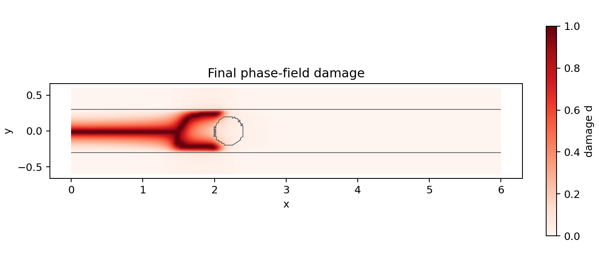
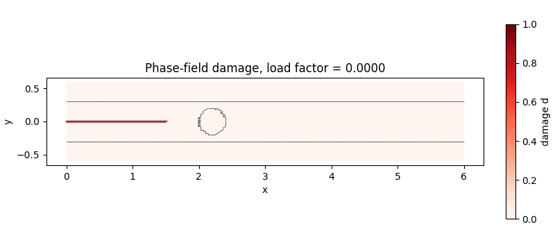

# DCB-Style Fracture With A Toughened Bulk Layer

This beta teaching example uses the standard PhAST schema-v2 workflow.
Change `config.yaml` to define the geometry, materials, loading, solver, and
outputs; no problem-specific solver loop is required.

Use the [standard simulation tutorial](../../docs/tutorial/07_standard_simulation_workflow.md)
for Python 3.10+ source installation on macOS/Linux or Windows, and follow
the [configuration style](../../CONFIGURATION_STYLE.md). The folder name is
historical: the input contains three bulk regions, not an independent
two-material interface law.

## Run The Example

From an installed PhAST source checkout:

```bash
# Explain the input; schema-2 dispatch requires the combined CLI release check.
python -m phast explain-config examples/two_material_dcb_beta/config.yaml

# Check the declarative problem before solving it.
python -m phast run examples/two_material_dcb_beta/config.yaml --validate-only

# Run on the CPU and retain a separate result directory.
python -m phast run examples/two_material_dcb_beta/config.yaml \
  --output_dir runs/two_material_dcb
```

Choose a new output directory for a subsequent run. The trajectory writer
refuses to overwrite an existing `training_data.h5` file.

Schema-2 explanation and new adapter checks are separate from the retained
results. Do not label the common command sequence verified until those checks
pass. Legacy `precheck --config` is not a universal schema-2 replacement.

## Edit The Same Sections

Use the order `schema_version`, `name`, `reference`, `geometry`,
`regions`, `materials`, `assignments`, `initial_conditions`,
`boundary_conditions`, `analysis_steps`, `solver`, `outputs`.

| Edit | Dependency or effect |
|---|---|
| `geometry.parameters.length/height/origin` | Update clamp coordinates, loading bounds, both layer rectangles, and disk/crack positions. |
| `geometry.parameters.nx/ny` | Check non-empty selections and mesh resolution of the material boundary. |
| Disk centre/radius in `regions` | Change the circle and every `outside_circle` selector together; check clearance from outer regions. |
| `materials.<name>.parameters.E` | Changes stiffness and stress/energy redistribution, not toughness. |
| `materials.<name>.parameters.Gc` | Changes fracture resistance; hold `E`, mesh, geometry, loading, and tolerances fixed for a toughness study. |
| `open_upper.value` / `open_lower.value` | Check signs, total opening, and small-strain/rotation assumptions. |
| `analysis_steps[0].controls.number_of_steps` | Includes zero; cutbacks can add increments. It is not elapsed time or an iteration cap. |

`initial_crack.thickness` is a node-selection distance, not a physical
opening. A mesh edit can leave a narrow selection empty. Material regions
select element centroids rather than generating conforming circular edges.
Keep shared `nu`, `l0`, Amor/AT2, plane-stress, and other common settings
consistent. Use positive `E` and `Gc` and only the initial/history fields
accepted by this adapter; the multi-material initial conditions are damage
constraints, not arbitrary initial fields. Dynamic multi-material execution
is outside this route.

Quasi-static analysis omits inertia; its illustrative density is not dynamic
material data. Explicit dynamics additionally needs consistent density/time
and a CFL-limited integration step. Neither a smaller step nor a particular
`h/l0` is a universal validation criterion.

## Physical Model

The rectangular specimen is 6.0 mm long and 1.2 mm high. Opposite vertical
displacements open its upper and lower left-edge loading regions; the right
edge is clamped. A prescribed initial phase-field crack extends from
`x = 0` to `x = 1.5 mm` on the mid-plane.

Three bulk regions share `E = 5000 MPa`, `nu = 0.30`, and
`l0 = 0.10 mm`, with plane stress and the Amor energy split:

| Region | Geometry | Fracture toughness Gc [N/mm] |
|---|---|---|
| Material 1 | Fracture-resistant outer regions | 1.00 |
| Weak layer | `-0.30 <= y <= 0.30 mm`, excluding Material 2 | 0.04 |
| Material 2 | Circle centred at `(2.2, 0.0) mm`, radius `0.20 mm` | 0.12 |

Material 2 is three times tougher than the weak layer, but less tough than
the outer regions. Equal elastic properties isolate a contrast in fracture
resistance; this is not a stiffness-inclusion example. The weak region
occupies half the specimen height and is a finite-thickness bulk material,
not a thin adhesive or a zero-thickness cohesive interface.

The final upper and lower displacements are `+0.15 mm` and `-0.15 mm`.
The total opening is therefore `0.30 mm`. The configured 121 load levels
include zero and give 120 nominal increments, with automatic cutbacks if a
trial increment fails to converge. Load factor is not physical time.

## Numerical Model

The calculation uses T3 elements, small-strain mechanics, and bounded AT2
phase-field damage. Each load increment alternates mechanical equilibrium
and damage solves; a final mechanical equilibrium solve follows the accepted
damage update. The solver checks the subproblems, damage increment, and
projected damage residual.

The `160 x 48` mesh has a maximum triangle-edge length of approximately
`0.0451 mm`, below `l0 / 2 = 0.05 mm`. This is a resolution criterion,
not proof of mesh-independent forces or crack trajectories. Material
boundaries are represented by element-centroid assignments on a structured
mesh, rather than by a geometrically conforming circular mesh.

The initial crack is maintained by a damage constraint. No damaged path is
prescribed through or around Material 2. Penetration, deflection, branching,
or arrest must be identified from the computed fields rather than assumed.

## Material Regions And Input Conditions



The example contains **three bulk material regions**, despite its historical
folder name. Blue denotes the outer Material 1, grey denotes the weak layer,
and ochre denotes the circular Material 2. All three have the same Young's
modulus, $E = 5{,}000$ MPa. Their fracture toughnesses are respectively
$G_c = 1.00$, $0.04$, and $0.12$ N/mm. Material 2 is therefore tougher than
the weak layer, not stiffer. The colours describe the input assignments;
they are not the red damage scale used in the result figures.

The plate measures $6.0 \times 1.2$ mm. The weak layer is $0.6$ mm high,
the circular region has radius $0.20$ mm, and the initial crack is $1.5$ mm
long. The right edge is fixed in both directions. The upper and lower
left-edge loading segments receive vertical displacements of $+0.15$ mm
and $-0.15$ mm at the final load factor, giving a relative opening of
$0.30$ mm. Horizontal displacement is not prescribed on these loading
segments. Other tractions are zero. The material boundaries do not have
an independent cohesive or interface law.

After installing PhAST, run this command from the repository root to draw
the setup before solving:

```bash
# Read the YAML, build its mesh and selections, and draw the inputs only.
python examples/two_material_dcb_beta/plot_setup.py \
  --config examples/two_material_dcb_beta/config.yaml \
  --output-dir runs/dcb_setup
```

The output is `runs/dcb_setup/material_regions_and_loading.png`. Use
`--config` with your edited YAML to inspect a modified setup. This command
uses the same PhAST mesh, material assignments, and node selections as the
solver; it neither solves the fracture problem nor establishes convergence.
New full calculations also write `material_regions_and_loading.png`.

## Standard Results

For a step-by-step explanation, use the
[layered DCB student notebook](../../docs/tutorial/notebook_layered_dcb.ipynb).
It connects the equations to editable geometry, materials, loads, solver
settings, and result interpretation. Retained images and animation are the
default; running a new simulation is an explicit choice.

Retained lightweight evidence is in [results/README.md](results/README.md).
It is not a new run of the documentation commands:





The static image is the animation fallback. Neither penetration nor completed
bypass is demonstrated. These are qualitative layered-material results,
not calibrated inclusion-bypass predictions. The retained coarse tough-region
run did not write HDF5; the retained uniform-layer control did. Its stored
mesh supplies the original triangle connectivity for the comparison plots.
Both new coarse reproduction inputs request HDF5.

A new run produces the following files. The checked-in results retain only
the compact subset described in [results/README.md](results/README.md):

- `training_data.h5`: initial and accepted displacement, strain, stress,
  damage, and history fields in float64, with mesh and material fields.
- `history.csv`: opening, reaction, connected crack front, and region damage.
- `solver_telemetry.csv` and `timing_per_step.csv`: convergence and timing.
- `final_fields.vtu`: final nodal and element fields for ParaView.
- `initial_conditions.png` and `material_fields.png`: inspectable model setup.
- `damage_final.png`, `displacement_final.png`, `strain_final.png`, and
  `stress_final.png`: final fields with material-boundary outlines.
- `damage_evolution.gif`: crack evolution; grey outlines show material boundaries.
- `load_displacement.png` and `convergence_and_crack_front.png`: response histories.
- `summary.json` and run/visual manifests: numerical summary and provenance.

Trajectory output is requested in the same configuration:

```yaml
outputs:
  fields:
    - {name: trajectory, format: h5, every: 1}
```

This heterogeneous route currently writes HDF5 trajectories. Omitting
`format` selects HDF5; requesting an unsupported format raises an error.

Reload fields with the standard PhAST result API:

```python
import phast

result = phast.load_result("runs/two_material_dcb")
damage = result.field("damage")           # Final nodal damage
displacement = result.field("displacement")
strain = result.field("strain")           # Element strain components
stress = result.field("stress")           # Element stress components
print(result.field_names())
```

The reported crack front is the furthest node with `d >= 0.80` connected
to the seeded crack through damaged mesh edges. A large maximum x-coordinate
alone does not establish traversal of the inclusion: inspect connectivity,
material membership, and the trajectory together.

## Interpretation And Limitations

This is a confined-layer DCB-style teaching model, not an ASTM D5528 test,
a pin-loaded specimen, a calibrated bimaterial benchmark, or a validated
crack-deflection prediction. The inclusion radius is only `2 l0`, and its
clearance from the fracture-resistant outer regions is `l0`. Confinement and
regularisation therefore influence the possible paths.

Convergence of the algebraic solves does not establish physical validity or
mesh/load-step convergence. A quantitative study requires an independently
specified reference, mesh and increment sensitivity, and an assessment of
whether small strains and rotations remain appropriate. A matched control
is needed before attributing a measured resistance change solely to the
inclusion.

## Reproduce The Separate Coarse Comparison

Keep this folder's `config.yaml` at `160 x 48` for the fine reference.
Two complete compact model inputs are provided under `comparisons/`:

- [tough_region.yaml](comparisons/tough_region.yaml): same physics/settings,
  with `nx: 120` and `ny: 48`.
- [uniform_layer.yaml](comparisons/uniform_layer.yaml): that same coarse
  input with only `materials.material_2.parameters.Gc` changed from
  `0.12` to `0.04 N/mm`.

The control retains the weak layer and resistant outer regions: it is not
a homogeneous specimen. Both files retain the reference metadata/default
output path; use the separate overrides below. This is model-data duplication,
not solver-code duplication; no new driver is required.

```bash
python -m phast explain-config examples/two_material_dcb_beta/comparisons/tough_region.yaml
python -m phast run examples/two_material_dcb_beta/comparisons/tough_region.yaml --validate-only
python -m phast run examples/two_material_dcb_beta/comparisons/tough_region.yaml --output_dir runs/dcb_coarse_tough_region

python -m phast explain-config examples/two_material_dcb_beta/comparisons/uniform_layer.yaml
python -m phast run examples/two_material_dcb_beta/comparisons/uniform_layer.yaml --validate-only
python -m phast run examples/two_material_dcb_beta/comparisons/uniform_layer.yaml --output_dir runs/dcb_coarse_uniform_layer
```

The retained fine run has 120 accepted increments, no cutbacks, maximum
projected damage residual `6.91e-6`, and final reaction `0.61495` in the
recorded unit-thickness convention. The separate coarse matched pair gives
`0.60938` versus `0.45847` reactions and `2.10` versus `2.40 mm`
connected fronts for tough disk versus control. Both fork early, so the
disk cannot be credited with causing initial branching. Cutbacks differ
despite matched solver settings. See the retained results for the full record;
these new comparison files have not been rerun in this documentation pass.

## Replot Compact Retained Evidence

This command only postprocesses stored comparison data; it does not rerun FEM:

```bash
python examples/two_material_dcb_beta/compare_results.py --output-dir runs/dcb_comparison_replot
```

It reads `results/coarse_tough_history.csv`,
`results/uniform_layer_history.csv`, `results/matched_control_fields.csv.gz`,
`results/matched_control_elements.csv.gz`, and
`results/comparison_provenance.json`. It writes
`matched_control_comparison.png` and `matched_control_damage.png` to the
requested directory without raw HDF5. A separate executable replot check
regenerated both PNGs from 250532 bytes of compact data; it was not a FEM run.
Historical source identity is unknown where not recorded; a later public
fingerprint is not evidence of prior generation. Histories have different
accepted load grids, so compare at common opening rather than common row number.

## Further Limitations And Help

Earlier, thinner-layer parameter sets produced transverse arm failure or
partial penetration. They are not evidence of successful traversal and
should not be confused with this revised, layer-contained inclusion model.

Independent stored-field checks found the fixed calculations numerically
acceptable; they are not an independent solver rerun or experimental
validation. Input-guard and publication checks remain separate. The historical
generating source fingerprint was not recorded at runtime; a later
public-availability fingerprint cannot establish historical source identity.

[Open a GitHub issue](https://github.com/CEMS-Lab/PhAST/issues/new/choose)
if a configuration section, convergence message, output, or limitation is
unclear. Include the config, exact command, OS, Python/PhAST version, and
complete error output.
