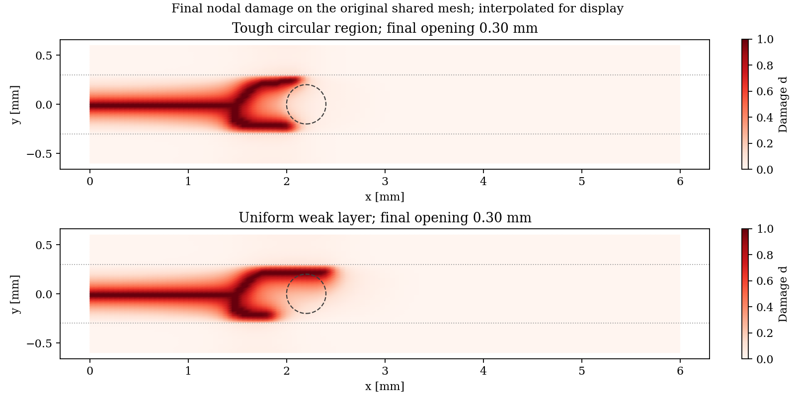
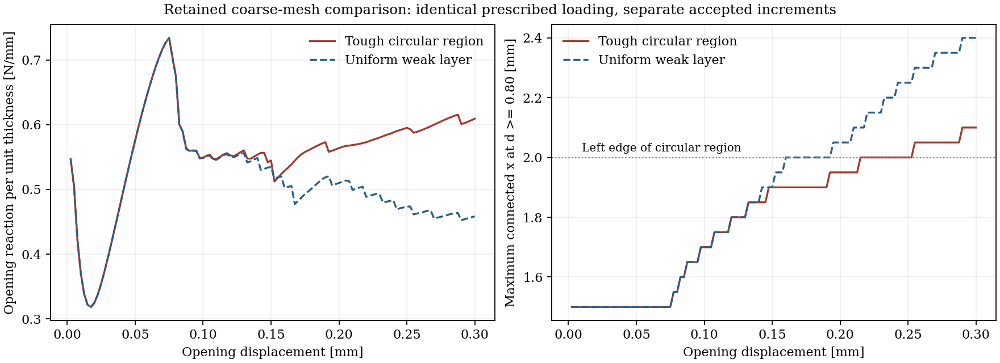

# Recorded DCB-Style Teaching Calculation

These retained figures and summaries describe the DCB model whose numerical
inputs are documented by the [schema-v2 configuration](../config.yaml).
The fine trajectory can be regenerated locally as HDF5; no large raw
trajectory is retained here.

These are retained records, not a new calculation from this documentation
update. The [online tutorial](../../../docs/tutorial/07_standard_simulation_workflow.md)
embeds the compact figures directly from the repository; raw HDF5 is not a
public documentation dependency. The generating source fingerprint was not
recorded at runtime and remains unknown. A later public-availability
fingerprint does not establish which source generated historical outputs.

## What The Calculation Demonstrates

At a total opening of 0.30 mm, the seeded crack bifurcates within the weak
bulk layer and advances towards the circular region's flanks. The outer
fracture-resistant regions retain the load path.

**Neither penetration through Material 2 nor completed bypass is demonstrated.**
No seed-connected path with `d >= 0.80` enters the circular region in the
recorded reference run. The fact that the front's x-coordinate overlaps the
circle's x-extent is not evidence of penetration.


The static image is the animation fallback. The displayed progression is
quasi-static load factor, not physical time.

## Numerical Evidence

| Quantity | Recorded reference value |
|---|---|
| Structured mesh | 160 x 48 cells, split into T3 elements |
| Nominal accepted increments | 120, without cutbacks |
| Final total opening | 0.30 mm |
| Maximum projected damage residual | 6.91e-6 |
| Stored damage range | 0 to 1 |
| Detected damage/history decrease | None in the saved snapshots |
| Maximum triangle edge divided by l0 | 0.4507 |
| Final seed-connected front at d >= 0.80 | 2.0625 mm |
| Final seed-connected front at d >= 0.90 | 2.0625 mm |
| Final reaction, unit-thickness model | 0.61495 |
| Recorded CPU elapsed time | About 968 s; not a portable performance benchmark |

The initial HDF5 frame contains the prescribed starting state. It is not
counted among the 120 converged load increments.

The `120 x 48` calculation with the same physical parameters gives a final
front of 2.10 mm and a reaction of 0.60938. The reaction difference is about
0.9%; the front difference is one fine-mesh x interval. This is a two-mesh
comparison, not a formal convergence study.

See [numerical_review.json](numerical_review.json) for the stored-field checks
and [summary.json](summary.json) for the solver-reported summary.

## Matched Toughness Comparison

A separate pair of calculations uses the same `120 x 48` mesh, loading,
constitutive parameters, solver tolerances, and nominal increments. The only
physical input changed is Material 2 toughness:

| Quantity at 0.30 mm opening | Tough circular region | No-contrast control |
|---|---|---|
| Material 2 Gc [N/mm] | 0.12 | 0.04 |
| Weak-layer Gc [N/mm] | 0.04 | 0.04 |
| Connected front [mm] | 2.10 | 2.40 |
| Reaction, unit-thickness model | 0.60938 | 0.45847 |
| Accepted increments | 120 | 123 |
| Automatic cutbacks | 0 | 3 |

The no-contrast control is uniform only within the weak layer; the outer
regions remain different bulk material. It is not a homogeneous specimen.
The same prescribed loading and nominal settings do not mean an identical
accepted load grid: the control has three cutbacks. The retained coarse
tough-region run did not write HDF5. The retained uniform-layer control did,
and its stored mesh supplies the original triangle connectivity for the
comparison plots. Both new reproduction inputs request HDF5; full trajectory
files are not included in these compact public results.

In this discrete comparison, the tougher region reduces crack advance and
increases the final reaction by approximately 33%. Both cases bifurcate, so
the initial branching must not be attributed solely to the circular region.
The circular outline in the control identifies the same geometric footprint;
it is not a material contrast in that calculation.





The comparison input check and measured values are recorded in
[matched_control_review.json](matched_control_review.json).

To reproduce the pair, use the complete
[tough-region input](../comparisons/tough_region.yaml) and
[uniform-layer input](../comparisons/uniform_layer.yaml). They preserve the
full DCB settings on `120 x 48` cells and differ only in disk `Gc`.
The fine [reference input](../config.yaml) remains `160 x 48`.

```bash
python -m phast explain-config examples/two_material_dcb_beta/comparisons/tough_region.yaml
python -m phast run examples/two_material_dcb_beta/comparisons/tough_region.yaml --validate-only
python -m phast run examples/two_material_dcb_beta/comparisons/tough_region.yaml --output_dir runs/dcb_coarse_tough_region

python -m phast explain-config examples/two_material_dcb_beta/comparisons/uniform_layer.yaml
python -m phast run examples/two_material_dcb_beta/comparisons/uniform_layer.yaml --validate-only
python -m phast run examples/two_material_dcb_beta/comparisons/uniform_layer.yaml --output_dir runs/dcb_coarse_uniform_layer
```

These files duplicate compact model data, not solver code; both use the
common runner and HDF5 output. Their new exact-command checks, including
schema-2 explanation, remain part of the combined release checks. The table
above records the existing runs, not a rerun of the newly named input files.
Use the explicit directories rather than their inherited output default.

## Replot Compact Retained Evidence

This command only postprocesses stored comparison data; it does not rerun FEM:

```bash
python examples/two_material_dcb_beta/compare_results.py --output-dir runs/dcb_comparison_replot
```

It reads `coarse_tough_history.csv`,
`uniform_layer_history.csv`, `matched_control_fields.csv.gz`,
`matched_control_elements.csv.gz`, and
`comparison_provenance.json`. It writes
`matched_control_comparison.png` and `matched_control_damage.png` to the
requested directory without raw HDF5. A separate executable replot check
regenerated both PNGs from 250532 bytes of compact data; it was not a FEM run.
Historical source identity is unknown where not recorded; a later public
fingerprint is not evidence of prior generation. Histories have different
accepted load grids, so compare at common opening rather than common row number.


## Fields And Interpretation

- [Displacement magnitude](displacement_final.png)
- [Strain tensor norm](strain_final.png)
- [Von Mises stress](stress_final.png)
- [Phase-field damage](damage_final.png)
- [Geometry and loading](initial_conditions.png)
- [Material properties](material_fields.png)
- [Convergence and connected crack advance](convergence_and_crack_front.png)

Large strain values in the heavily damaged crack band represent the smeared
displacement jump and must not be interpreted as intact-material strains.
In the relatively intact outer regions, the final strain-norm maximum is
approximately 1.67%, and the 95th-percentile infinitesimal rotation is about
4.9 degrees. These values warrant retaining the small-strain/rotation
approximation caveat rather than claiming geometric-nonlinear validity.

Independent stored-field review found the fixed calculations numerically
acceptable, with bounded, irreversible damage/history. Recomputing history
from final displacement gave maximum projected residuals of 6.97e-6 for the
fine case and 5.23e-6 for the control. These are separate final-state checks,
not replacements for the solver-recorded maxima over accepted increments.
The review was not an independent solver rerun or experimental validation;
input-guard checks and publication checks remain separate.

The inclusion radius is `2 l0` and its clearance from the outer regions is
`l0`. Confinement, regularisation, the structured material-boundary
approximation, and load-increment sensitivity remain relevant. No experimental,
ASTM, interface-law, or material calibration claim is made.
